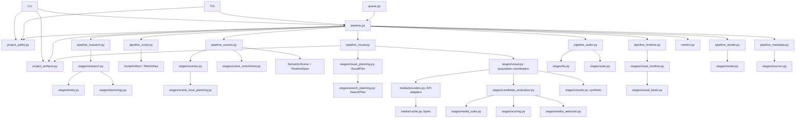

# Auditoria da arquitetura real do Curio e plano de migração

Data: 2026-10-04  
Atualizado: 2026-10-05
Base de auditoria inicial: commit `7d0c148` e checkout limpo. Estado arquitetural revisado até `4163fdf` mais os testes/documentação em `bb07252`; G6 migrou a asserção de metadata para seu módulo dono, A4v definiu precedência do tópico pesquisado e aliases com provenance verificada, D4 tornou a identidade de conteúdo comum à seleção e métricas, `project_paths.py` possui layout/resolução, `audio/composition.py` política/efeitos de áudio, `project_artifacts.py` I/O, `pipeline_finalize.py` finalização humana, `pipeline_human_prep.py` preparação humana, `script_input.py` roteiro pronto e `visual_timeline.py` geometria temporal. O late reuse emite decisão coerente e delega a ordenação de doadores a `media_selection`; a projeção das linhas de auditoria de candidatos está em `visual_audit.py`; prioridade de adapters por plano está em `media_provider_policy.py`; G19 preserva tópicos descritivos sem truncá-los como entidades; G20 confirma identidade de conteúdo antes de concluir a busca por alternativas; E7 assina inputs do cache de roteiro e título. Suíte integral mais recente: 909 testes em 192,93 s.
Escopo: todos os módulos Python de `src/curio`, CLI/TUI, configuração, estágios, adapters, providers, caches, métricas, formatos de projeto, suíte de testes, README, `VIDEO.MD`, `REGRAS.md`, relatório/análises recentes. A leitura estrutural foi feita por inventário AST/imports/chamadas; módulos e caminhos de maior risco foram lidos diretamente, especialmente `pipeline.py`, `scenes.py`, `visual.py`, `visual_context.py`, `scoring.py`, providers/cache, áudio, timeline, render, configuração e persistência.

## Conclusão

A separação física feita nos commits anteriores é útil e está preservada. Esta auditoria começou como baseline do commit indicado acima; os relatórios de migração registram mudanças posteriores. A tabela e o fluxo abaixo foram atualizados em 2026-10-04 contra o checkout atual. Há agora contratos explícitos de cenas, visual, busca, candidatos, seleção, roteiro/título e cache TTS. Ainda permanecem fronteiras em transição: resultados de mídia/timeline/render mantêm estruturas parcialmente em dicts, `visual.py` coordena muita aquisição e fallback, e `pipeline.py` ainda coordena a execução e vários efeitos de projeto.

O contrato semântico corrente é `SemanticScene`; o planejamento persiste `ScenePlanResult` (`SemanticScene[]` + `TimelineSpan[]`) em `script/scene-plan.json`. `Chapter` sobrevive como projeção de compatibilidade para dados de projeto e alguns consumidores. `scene_enrichment.py` é a transformação pós-planner. Na mídia, `VisualPlan` e `SearchPlan` separam intenção de query; providers retornam `MediaAsset`, `Candidate` carrega a query/proveniência, avaliação produz evidência/rejeição e `SelectionDecision` declara a seleção. Isso reduz a interpretação cruzada, mas a aquisição ainda é coordenada pelo módulo visual e timeline faz seleção de inserções por heurística lexical.

`VIDEO.MD` define a identidade editorial do produto, não interfaces de software. README e relatórios documentam capacidades e migrações; código e artefatos persistidos são a evidência operacional.

## A. Fluxo realmente executado

```text
CLI / TUI / queue
  → CurioConfig + run_pipeline (paths, RunLog, RunMetrics, SourceRegistry)
  → pipeline_research: ResearchResult + target + sources/etymology
  → pipeline_script: provided/cache/LLM/template → ScriptArtifact + TitleArtifact
      → grounding + script/artifacts.json; edited text invalidates derived stages
  → pipeline_scenes: ScenePlanResult from validated cache | LLM | local planner
      → scene_enrichment transformation → SemanticScene[] + TimelineSpan[]
      → scene-plan.json; chapters.json is a compatibility projection
  → pipeline_visual: manual selection | signed project selection cache | acquisition
      → per SemanticScene: VisualPlan → SearchPlan → provider query/results
      → MediaAsset → Candidate → evaluation/rejections → SelectionDecision
      → downloads, diversity/reuse and semantic synthetic fallback
  → pipeline_media_sources: selected works, rights and credits
  → assisted: pipeline_audio (TTS/cache manifest → timing → subtitles)
    human prep: estimated timing → silent render + teleprompter
  → pipeline_timeline: visual beats/inserts → timeline artifact
  → pipeline_render + render stage: cached/rebuilt segments → final MP4
  → pipeline_metadata + metrics: metadata, source reports, contact sheet, metrics
```

| Etapa | Entrada → saída atual | Dono atual e quem reescreve/depois usa | Side effects, cache, falhas e testes existentes |
|---|---|---|---|
| Entrada/config | CLI/TUI args + TOML/env → `CurioConfig` | `config.py`; CLI aplica overrides; TUI também altera config. `queue.py` clona via `__dict__` e aplica overrides dinamicamente. | Paths/env; defaults/clamps/coerções. `test_*config*`, CLI/TUI tests. |
| Project layout | output root + genre + slug → `VideoPaths` imutável; project reference → resolved paths | `project_paths.py` é dono do contrato de artefatos, construção de caminhos, leitura dos dois layouts (legado e `genre/slug`) e listagem de projetos. Pipeline, CLI e TUI consomem o mesmo módulo; o pipeline não define nem reexporta o contrato. | Sem I/O de conteúdo; existência de diretórios/metadata apenas na resolução/listagem. `test_slug`, CLI/TUI, pipeline integration. |
| Project artifact I/O | artifact path → text/JSON value; JSON value → persisted file | `project_artifacts.py` concentra leitura UTF-8 de texto/JSON e gravação JSON com criação defensiva do diretório pai. Pipeline, CLI e pipeline_visual consomem a mesma implementação; schemas/metadata e decisões de cache continuam com os respectivos owners. | File system; exceções permanecem visíveis salvo recuperação explícita do estágio. Pipeline/media/CLI integration. |
| Research/entity | ideia + gênero → `ResearchStageResult` (`ResearchResult`, alvo, fontes, fatos/etimologia) | `pipeline_research.py` coordena `stages/research.py`, `stages/entity.py`, fontes e persistência. Consumers downstream recebem contexto/alvo/resultados, não devem refazer pesquisa. | Wikipedia/DDG e fontes especializadas via HTTP; cache de etimologia é persistente. Pesquisa pode aceitar grounding fraco (`allow_weak=True`). `test_research*`, entity, etymology, grounding. |
| Script/title | pesquisa/entidade, gênero e ideia ou texto do usuário → `script.txt`, `title.txt` | `script.py` decide LLM/template/fallback; `pipeline_script.run_script_stage` coordena cache, autocura, grounding, persistência e `ScriptStageResult`. | Cache ainda representa artefato persistido do projeto; não possui assinatura de pesquisa/configuração. Para texto fornecido, mudança é detectada e invalida cenas/mídia e TTS. Falhas e templates em `test_llm*`, script tests, pipeline integration. |
| Scene planning | roteiro + alvo de cenas + gênero/diretiva → `ScenePlanResult` (`SemanticScene[]` + `TimelineSpan[]`) | `stages/scenes.py` oferece planners LLM/local que convergem para o contrato. `pipeline_scenes.run_scene_stage` carrega o artefato validado, faz enriquecimento único em `scene_enrichment.py`, valida e persiste `script/scene-plan.json`; `chapters.json` é projeção compatível. `SceneStageResult` é a saída da etapa. | LLM JSON com fallback local; cache do plano por projeto, invalidado explicitamente quando muda roteiro ou `force`. `scene-plan.json` tem versão de schema; `chapters.json` é compatibilidade legada. `test_scene_contract`, scene stage/integration, LLM fallback/timeout. |
| Semantic enrichment | plano semântico + tópico/alvo/fontes/etimologia → cenas semânticas enriquecidas | `scene_enrichment.enrich_scenes` é a transformação única pós-planner; `VideoContext`, `Alias` e `VisualRepresentation` mantêm contexto e proveniência em `scene_contract.py`. Pesquisa externa de aliases/contexto ocorre nesse limite, não no acquisition. | Enriquecimento pode fazer requests de pesquisa configurados e invalida mídia se mudou o plano. Fallback local e LLM produzem o mesmo contrato; `source`/`planning_mode` continuam provenance. `test_visual_context`, entity, scene tests. |
| Visual planning | `SemanticScene` → `VisualPlan` | `stages/visual_planning.py` fecha o contrato sem narração para busca e deriva políticas tipadas de gênero/cena. Não adquire mídia. | Determinístico. Os cues atuais de mecanismo/história são uma dívida identificada: validar possível vazamento entre gêneros antes de centralizar mais políticas. Tests visual planning/contracts. |
| Search planning | `VisualPlan` → `SearchPlan` de queries ordenadas e proveniadas | `stages/search_planning.py` gera árvore limitada de queries sem ler narração; cada `SearchQuery` marca representation, variante, nível e alias. | Determinístico e sem I/O; queries são submetidas depois pela aquisição. `test_search_planning`, query regressions. |
| Provider acquisition | `SearchPlan` + configuração → resultados `Candidate` | `stages/visual.py` coordena requests, prioridades, concorrência/timeout, cache de pesquisa, download e preparação de candidatos. `media/providers.py` adapta APIs para `MediaAsset`; provider não decide relevância editorial. | Providers HTTP, download/cache persistente, Pillow/ffprobe. `media/cache.py` guarda bytes e provenance. `pipeline_media.py` atende mídia manual/standby; rerender não pesquisa. `test_media_*`, provider/cache/funnel. |
| Candidate evaluation/selection | `Candidate` + `VisualPlan` → avaliações e `SelectionDecision` | `stages/candidate_evaluation.py` aplica filtros/scoring e produz evidência/rejeições; `stages/media_selection.py` decide relevância e diversidade/reuso; `stages/media_rules.py` aplica restrições técnicas/rights. `stages/visual.py` ainda coordena o fluxo e fallback. | CLIP opcional; fallback sintético e reuso são decisões observáveis. Ainda existe coordenação de aquisição/fallback concentrada em visual stage, alvo de migração incremental. `test_visual_*`, candidate, selection, diversity regressions. |
| Audio/TTS/subtitle | script + cenas + tempos → `AudioStageResult` com spans, words/timing, subtitles, warning/time deltas | `pipeline_audio.run_audio_stages` coordena `stages/tts.py`, `timing.py` e `subs.py`; entrega state deltas em vez de alterar os dict/list do coordenador. `audio/composition.py` possui projeção de preferências persistidas e composição de SFX/fades, consumida pelo pipeline e CLI. Humano usa `finalize_project` com transcrição e o mesmo limite de timing. | `audio/tts-manifest.json` assina roteiro/config TTS; cache legado requer metadata e transcrição idêntica. Mudança de texto invalida áudio derivado. Falha de alinhamento vira timeline proporcional. |
| Visual timeline | cenas semânticas + seleção → `VisualTimelineResult`/artefato | `pipeline_timeline.py` coordena `stages/visual_timeline.py` e `visual_beats.py`; timeline consome seleção, mas ainda possui heurísticas editoriais para inserções. | Determinístico por seed/timestamps/config; persiste `visual_timeline.json` em multi-image. Inserção lexical continua acoplamento residual. |
| Render | cenas + seleção + timeline + áudio/config → segmentos e MP4 | `pipeline_render.py` e `stages/render.py` fazem adaptação/composição; `pipeline.py` encadeia as etapas e política de assinatura/cache FFmpeg. | ffmpeg/ffprobe, segmentos persistidos e assinaturas; final reuse também valida narration/subtitle/transition/music inputs. Tests render, pipeline integration, verify. |
| Metadata/metrics/review | resultados de etapas → `metadata.json`, `media.json`, `sources.json`, métricas/review | `pipeline_metadata.build_base_metadata` cria projeção comum de cenas/media para humano e assistido; `persist_run_metadata` fecha tempos/path e persiste. `pipeline.py` ainda acrescenta campos específicos por modo. `metrics.py` agrega métricas; `stages/review.py` apresenta artefatos persistidos. | Backfill mantém campos desconhecidos nulos quando possível. Ainda há métricas live e históricas reconstruídas com fontes distintas; exige canonização faseada. |
| CLI/TUI/queue | usuário/projeto → invocação/edição/retomada | CLI declara subcomandos; TUI é outra interface para mesmos serviços, mais configuração/menu. Queue serializa estado e invoca `run_pipeline`. `swap` altera `media.json`; `rerender` reconstrói sem buscar; `finalize` usa áudio humano. | Projeto é contrato externo entre execuções; lista/status de queue em JSON. Testes CLI, TUI, queue/standby, review/rerender/CLI. |

As seções D–F abaixo registram achados da auditoria inicial, antes das migrações incrementais. Consulte o relatório de migração e o README para decisões posteriores. Achados de responsabilidade que continuam presentes foram mantidos como dívida; descrições de implementação que já mudaram não devem ser lidas como estado atual.

O layout de saída é o contrato externo de facto para projeto existente: `script/`, `sources/`, `media/`, `audio/`, `subtitles/`, `timeline/`, `render/`, `review/`, `teleprompter/`, `metadata.json`. `Chapter.to_dict/from_dict`, `MediaAsset.to_dict/from_dict`, e dicionários de seleção/timeline formam o schema implícito. O único marcador geral é `pipeline_version="scenes-0.2"`; não há versão/schema por artefato.

### CLI, TUI e modos

- CLI: `generate`, `from-script`, `finalize`, `sources`, `list`, `info`, `review`, `swap`, `rerender`, `verify`, `metrics`, `voices`, `music`, `doctor`, `queue`, `tui`.
- TUI: menus para gerar IA, preparar narração humana/finalizar, roteiro colado, fila, projetos, configuração, diagnóstico/manutenção. Despacha para `run_pipeline`/`run_script_pipeline`/`finalize_project`, mas lê e edita artefatos em comandos de projeto.
- Queue: salva `QueueItem`/status JSON, clona config por atributos, roda cada item no pipeline normal e marca `PAUSED` em `MediaStandby`.
- `swap` usa somente candidatos baixados já persistidos e chama `rerender`; não chama pesquisa/TTS. `rerender` usa `media.json`/chapters e atualiza timeline/MP4. `finalize` transcreve áudio humano, aplica tempos/legendas e renderiza.

## B. Grafo de dependências e acoplamentos



O grafo atual já não tem o ciclo físico histórico de `scenes → visual.local_queries → scenes`; isso foi removido ao fazer o planner local produzir `SemanticScene`. O caminho nominal da semântica é dirigido: cenas → enrichment → VisualPlan → SearchPlan → aquisição → avaliação → seleção. O principal acoplamento remanescente é coordenação: `stages/visual.py` orquestra busca, download, fallback e seleção; a timeline conserva heurísticas para inserções; `pipeline.py` mantém a ordem, cache/invalidação e side effects do projeto. `pipeline_media.py` trata mídia manual/standby. A linha de base anterior mencionava Chapters mutáveis e contratos apenas implícitos; essa observação é histórica, não descrição do checkout atual.

## C. Fontes de verdade atuais e desejadas

| Conceito | Fontes encontradas / inconsistência | Fonte única desejada |
|---|---|---|
| Tópico | `idea`, `TargetEntity.name`, `video_context.topic`, `global_visual_queries`, `Chapter.subject` | `VideoContext.topic` tipado com provenance; ideia original permanece input editorial, não semântica inferida. |
| Gênero | CLI/TUI → `cfg.genre`, argumento `genre`, `genre_key`, metadata, diretivas passadas estágio a estágio | chave normalizada resolvida uma vez em `GenerationContext`, com `GenreAdapter` imutável. |
| Entidade principal | `ResearchResult.target`, `Chapter.primary_entity`, `subject`, `video_context.primary_entities` | `VideoContext.primary_entity: EntityRef`; cenas referem entidade explicitamente se aplicável. |
| Aliases | target heuristic/LLM, Wikipedia langlink em `visual_context`, `subject_aliases`, aliases contextuais e `textnorm.translate*` | lista de `Alias(value, language, provenance, verified)`; tradução lexical nunca promove identidade. |
| Intent/representations | `visual_intent`, `visual_intent_structured`, entities/context/event/place/period, `representations`, `visual_queries`, `global_visual_queries` | `SemanticScene` decide significado; `VisualPlan` tem representação primária e alternativas tipadas. Query é derivada, não segunda intenção. |
| Query | `local_queries`, `_waterfall_queries`, adapter generic queries, visual_queries, global queries | `SearchPlan` imutável emitido por um SearchPlanner puro que não lê narração. |
| Provider result/asset | `MediaAsset` e suas projeções dict; `MediaSource` no registro; render timeline com campos reduzidos | `Candidate` envolve `MediaAsset` normalizado e conserva query/request/provenance sem cópias editoriais. |
| Identidade de asset | download cache `provider/asset_id`, URLs de source, IDs do provider e arquivos locais | `media.identity.asset_identity`: SHA-256 quando há arquivo local; URL normalizada e provider+ID são fallbacks. |
| Layout do projeto | `VideoPaths` em `pipeline.py`, `_paths_for_slug`, chamadas CLI/TUI e helpers de `slug.py` | `project_paths.py` define `VideoPaths` imutável e é fonte única de construção/resolução/listagem de projeto. |
| Uso/reuso/diversidade | `asset_uses`, `reuse_reason`, `reused_from`, `reuse[]`, duas passagens e métricas que recalculam occurrences | ledger por geração + `SelectionDecision`; uso de asset é fato de seleção, métrica só projeta o mesmo fato. |
| Fallback | `visuals.LADDERS`, caso typographic no media engine, diagrama, reuse, `MediaStandby`, render fallback | `FallbackPolicy` central ligada a `VisualPlan`, com nível e motivo explícitos. Render só apresenta decisão final. |
| Duração | config target, Chapter duration estimate/start/end, TTS audio duration, timeline/beat times, metadata duration actual | `Timeline` com unidades explícitas e um dono de timing; scene plan não guarda múltiplos relógios inferidos. |
| Estado execução | RunLog stage string, callbacks progress, queue enum/status, metadata standby/normal, CLI códigos | `RunState`/stage outcome tipados; compatibilidade externa continua traduzida nas bordas. |
| Métricas | `RunMetrics` contadores live, cena_decisions e visual_report, metadata, metrics JSON, backfill | evento/métrica canônica com definição/unidade/fonte; zero somente quando observado; ausência histórica `null`. |
| Roteiro/título | `script.txt`, `title.txt`, metadata `script_source/title_source`, e cache inferido só pela presença do arquivo | conteúdo do arquivo é estado editorial do projeto; `ScriptArtifactsManifest` valida hashes/proveniência e vínculo do título ao roteiro de origem. Só `force` deve pedir nova geração; edição externa identificada invalida derivados. Projetos legados sem manifesto têm provenance desconhecida até migrarem. |
| Cache | pesquisa em memória por execução, download/sidecar, script/chapter/media JSON, TTS e manifesto, etymology JSON, áudio biblioteca, segmentos/MP4 assinados | namespaces explícitos: search response, downloaded bytes, projeto editorial, derived artifact, editorial decision. Cache de bytes nunca determina seleção. Lifecycle TTS é validado; lifecycle de outros artefatos segue em migração. |
| Config | `CurioConfig` + TOML/env + CLI override + alterações TUI + queue cópia dinâmica | snapshot normalizado imutável por execução; interface constrói configuração, estágios apenas consomem. |

## D. Reparos silenciosos e reconstruções de significado

| Local | Comportamento | Classificação |
|---|---|---|
| `CurioConfig.load` | defaults, parse, normaliza idioma, clampa enums/limites, ignora alguns env inválidos | normalização legítima em config; precisa diferenciar erro de usuário vs valor default nos casos importantes. |
| providers / `MediaAsset.__post_init__` | provider adapta payload, normaliza tags e rights | normalização legítima na borda externa. |
| `Chapter.from_dict`, `_coerce_*` | aceita schema antigo, descarta visual_type/papel/query inválidos, infere tipo ausente de narração | compatibilidade legada necessária; hoje também mascara payload inválido sem resultado uniforme de validação. |
| `scenes.build_chapters` | aceita envelopes variados; completa queries de representations; repara narração via alinhamento aproximado e junta/divide cenas | reparo estrutural potencialmente legítimo se evidência forte, mas responsabilidade do planner/normalizador e resultado da reparação devem ser reportados no contrato. |
| pipeline após scene planner | injeta contexto/aliases/queries, muda tipo e intenção; busca langlinks; enriquece etimologia | responsabilidade no lugar errado; saída não é válida até pós-processamento. Deve virar input explícito do planejamento ou enriquecimento único antes de fechar SemanticScene. |
| caminhos local/cache | pipeline detecta origem pelo `scenes_source`/string `local fallback`; scoring trata as cenas de modo diferente | dívida perigosa: provenance da origem afeta semântica, em vez de mesma estrutura válida. |
| `script` cache | remove marcadores de lista em cache antigo e altera roteiro salvo | compatibilidade de conteúdo, mas mutação silenciosa deve virar migração versionada/reportada. |
| `visual_context.fill_missing_context` | faz request HTTP e fabrica/ancora queries/contexto após planner; usa dicionário lexical apenas em lugar | semântica + rede no enrichment; alto acoplamento e alias sem provenance completa. |
| `scoring.semantic_relevance` | decide que campos representam tópico/cena, cria fallback “contextual representation” pela presença de tokens de medium e detecta caminho local pelo prefixo | avaliação deve consumir VisualPlan; atualmente reconstrói o conteúdo pretendido. |
| `visual._waterfall_queries` | cria aliases/contexto/medium/generic queries conforme representação/genre/local flag | SearchPlanner atual também decide parte do significado e fallback editorial. |
| `visual._search_scene...` | hard gate, score, shortlist, download, síntese e reuse em um fluxo; falhas viram prosseguimento/fallback | fallback legítimo, mas responsabilidade não está em política/decision explícita. |
| pipeline `media.json` reuse | reusa seleção anterior se IDs/caminhos/hard gate passam; invalidation depende de `force_after_script` | cache de decisão editorial acoplado a arquivo/percurso de invalidação; assinatura completa de plano não é fonte do cache. |
| `manual_media_scenes` | associa arquivos em ordem e faz round robin quando há menos imagens; cria decision de formato distinto | fallback legítimo do usuário, mas violação da mesma forma de SelectionDecision; repetição manual é comportamento deliberado que deve marcar origem/reuso. |
| `pipeline_audio` | se word alignment falha, estima tempos proporcionalmente | fallback legítimo, mas chapters são mutados e a fonte/precisão do tempo fica em string paralela. |
| `visuals._role`, render fallback | deriva papel tipográfico ou desenha título genérico se faltam dados | apresentação fallback razoável; downstream deve receber visual final explícito, não reinterpretar semântica. |
| `metrics.backfill_from_metadata` | reconstitui counts e tenta deixar requests/token/downloads `null` | compatibilidade legítima; alguns campos ainda têm valores derivados/defaults e semânticas live/backfill podem divergir. |

## E. Heurísticas e regras concorrentes

| Regra | Implementações/localização | Competição/risco |
|---|---|---|
| Keywords/representações | prompts de cena, `_coerce_visual_terms`, `_coerce_representations`, `local_queries`, `_local_chapters`, textnorm topic phrases, `_waterfall_queries` | contrato aceita várias listas paralelas; planner local e LLM têm fontes de query diferentes. |
| Stopwords/tradução | `textnorm` compartilhado, `research.extract_keywords`, `entity`, `scoring`, `visual.local_queries`, timeline | normalização textual virou input semântico; traduções polissemânticas ainda podem criar pesquisa errada. |
| Tema e alias | TargetEntity, target aliases, `attach_video_context`, `anchor_local_topic`, Wikipedia langlinks, `fill_missing_context`, scoring | alias é dado do pesquisador, mas também consequência de request pós-planner e tradução; evidência não acompanha todos. |
| Gênero | `GenreAdapter`; scripts/scenes/research/visual/typography/audio consumers; `scenes._genre_forbidden`; transições `pipeline_render` por substring | política declarada convive com regras hard-coded nas etapas. Ordem de provider também recebe política na cena. |
| Visual type | prompt; `classify_visual_type`; `Chapter.from_dict`; pipeline contexto; scene type; scoring e `visuals.strategies_for` | mais de um estágio pode redefinir tipo; tipo também escolhe busca e fallback. |
| Providers | ordem global `PROVIDER_PRIORITY`, override histórico em `_provider_priority_order`, genre adapter priority, provider availability | mais de uma lista/ordem; disponibilidade e ordem se misturam com cena/genre dentro do search. |
| Threshold/relevância | `media_rules` hard gate, `scoring.DEFAULT_THRESHOLD`/env, generic score, contextual gates, CLIP opt-in | vários estágios aprovam/elegem; scores lexical/semânticos e pipeline genérico não são uma única avaliação. |
| Dedup/diversidade | `seen_ids`, `_selection_asset_key`, `asset_key`, `asset_uses`, reuse resolution, annotation, metrics hash/occurrences | identidade difere entre search/download/metrics; cópias do mesmo conteúdo podem divergir por URL/id. |
| Fallback/visual local | `visuals.LADDERS`, regras no search para typographic, diagrams.py, `_synth_diagram_for_scene`, reuse contextual, manual standby, render title fallback | diferentes escadas e owners; `visuals` ladder não governa por si só aquisição e pipeline standby. |
| Timeline visual | `visual_beats.plan`, `visual_timeline._topic_terms`/`_topic_score`, scene insertion, render transitions parsing narration | timeline toma pequena decisão de adequação editorial depois que seleção terminou. |

Os adapters editoriais são predominantemente dados congelados/dataclasses (`Pacing`, `ResearchStyle`, `NarrativeStyle`, `VisualStyle`, `GenreAdapter`) e não executam HTTP, LLM ou FFmpeg. Isso é uma boa fronteira a preservar. O vazamento não é que o adapter faça I/O: são consumidores que complementam política do gênero com suas próprias heurísticas.

## F. Módulos grandes e concentração de responsabilidades

| Módulo | Tamanho aproximado | Avaliação |
|---|---:|---|
| `pipeline.py` | 739 linhas atual (1.126 na revisão anterior) | Coordena geração, human prep e ordem global. Layout, artifact I/O, composição de áudio e workflow finalize têm owners separados. `run_pipeline` ainda encadeia muitas etapas e `_human_prep` compõe timeline/render/metadata; aquisição visual segue um fluxo grande próprio. |
| `pipeline_finalize.py` | 275 linhas | Possui o workflow de áudio humano: valida entrada, carrega artefatos, alinha duração, transcreve, legenda, compõe áudio, renderiza e persiste metadata. Consome os owners correspondentes; manter sob observação a quantidade de efeitos no workflow enquanto contratos de resultado evoluem. |
| `stages/visual.py` | 1.123 linhas atual (1.276 na revisão anterior) | Orquestra busca por cena, prioridades/requisições, download, shortlist/fallback sintético, seleção/reuso e recuperação multi-asset. SearchPlanner/evaluation, regras de roteiro pronto e builder de timeline saíram. Aquisição segue concentrada; próximos cortes devem seguir contratos/fases de busca reais, não tamanho. |
| `stages/visual_timeline.py` | 386 linhas atual | Possui geração de beats, geometria, backgrounds, inserções, transições/SFX e rebuild visual sem aquisição. Consome a saída selecionada. |
| `stages/scenes.py` | 1.035 linhas | Planner LLM/local, parsing e reparo de payload, segmentação, heurísticas visuais determinísticas e o modelo `Chapter` de compatibilidade convivem. Produção semântica e adaptação de formato legado ainda compartilham módulo, mas consumidores internos já migraram; separar compatibilidade é justificável sem mexer no planner. |
| `stages/visuals.py` | 930 linhas | Escolha/renderização de cards, formas, pessoa/data/citação/contraste e diagramas sintéticos, mais estado de variedade. Há `diagram.py` para outro formato de diagrama: overlap real a auditar antes de consolidar. A função de seleção de estratégia segue perto do renderer; não dividir apenas por tamanho. |
| `stages/research.py` | 1.058 linhas | HTTP Wikipedia/DDG, keyword/query planning, ranking/identity acceptance, RAG completion, evidence facts, prompt formatting e grounding verification continuam reunidos; provider acquisition já tem adapters em `research_sources.py`, mas planejamento, relevância e redação ainda têm donos sobrepostos. |
| `stages/nvidia.py` | 1.094 linhas | Credenciais/provider registry, HTTP/retry/timeout, fallback chain, resposta JSON/repair e helpers de script continuam juntos. Prompts estão majoritariamente em `prompts.py`; transporte e orquestração da chain são divisíveis após contratos de LLM. |
| `cli.py` / `tui.py` | 1.065 / 1.307 linhas | Parser/workflows/manutenção e menus/config/workflows/projetos permanecem em interfaces externas. Não há evidência de acoplamento interno novo que justifique reorganizá-las antes de stage contracts e run state. |
| `metrics.py` | 681 linhas | Acumulador concorrente e projeções live/backfill ainda convivem. Métricas visuais de seleção agora usam `media/selection_metrics.py`; timeline visual está separada, mas timers e derivação histórica seguem decisões múltiplas. |
| `stages/visual_context.py` | 294 linhas | Transformações de contexto e request de langlinks/identity scoring convivem. Enrichment está centralizado, porém I/O de resolução de alias ainda atravessa a fronteira semântica. |

## Fase 2 — Arquitetura-alvo e contratos

Arquitetura alvo sem pipeline paralelo:

```text
Input + ConfigSnapshot
 → ResearchResult + VideoContext (com proveniência)
 → ScriptArtifact (texto imutável + origem)
 → SemanticScene[] (mesmo contrato para LLM/local/cache)
 → VisualPlan[] (intenção fechada + alternativas/ladder permitidos)
 → SearchPlan[] (queries/contexto/provider policy já decidido)
 → Candidate[] (payload normalizado pelo provider, query/request ligada)
 → Evaluation[] (hard rejects, evidência/scores distintos)
 → SelectionDecision[] (winner/reuse/synthetic/none + reason)
 → Timeline (só tempo/apresentação)
 → RenderArtifact + Metadata/Metrics
```

Contratos propostos, sem criar framework:

- `VideoContext`: tópico canônico, target entity, aliases tipados com origem/idioma/verificação, contexto editorial/pesquisa.
- `SemanticScene`: ID/span de script e narração literal, intent, primary entity/event/place/period, concepts/entities, uncertainty/provenance. Não guarda queries finais nem tempo de render.
- `VisualPlan`: uma intenção que o visual deve comunicar; representação primária e alternativas tipadas; aliases aplicáveis; formas/ladder de fallback permitidas.
- `SearchPlan`: lista ordenada de `SearchQuery` com representação de origem, nível/variante, contexto obrigatório, provider preference e motivos. SearchPlanner não recebe/analisa narração.
- `Candidate`: `MediaAsset` normalizado + query/request/provider provenance. Provider só conhece API e retorna candidatos.
- `Evaluation`: technical/legal pass/reject, topic/scene evidence separada, score explicado, provenance dos campos usados. Não gera queries nem altera cena.
- `SelectionDecision`: winner, ordered candidates/rejections bounded, diversity identity/usage, fallback level e razão explícita; reuse é resultado editorial distinto de fresh acquisition.
- `Timeline`: intervalos e apresentational beats só depois de seleção; renderer nunca escolhe asset nem busca.
- `ExecutionMetrics`: projeções com definições canônicas e provenance live/backfill/unknown; decisão persistida é origem para métricas de seleção.

Os conceitos são dados simples: dataclasses/enum apenas onde validam invariantes concretos. Providers/adapters/cache mantêm fronteiras existentes; não adicionar event bus, DI ou dependências pagas.

### Invariantes a converter em teste

1. SemanticScene preserva o texto/spans do script; nenhuma etapa posterior o reescreve.
2. Planner LLM e planner local produzem o mesmo contrato validado; consumers não consultam `scenes_source` para mudar semântica.
3. Alias usado numa query possui valor, idioma e proveniência; tradução lexical isolada nunca cria entidade.
4. Representação/alternativa deve ser concreta e ligada à cena; palavra isolada não vira query.
5. SearchPlanner recebe plano visual estruturado e emite query completa; não lê narração, contexto bruto ou chama provider.
6. Provider recebe uma query e retorna candidatos normalizados; não decide relevância/diversidade/fallback.
7. Evaluator não cria query, altera cena nem seleciona candidato; todo score/rejeição conserva evidência.
8. Selector considera só avaliação aprovada; identidade do asset é única e reuso não conta como fresh acquisition.
9. Fallback não contorna gates; toda cena entrega selection decision ou motivo verificável para ausência/standby.
10. Cache de busca/bytes/artifact acelera operação, mas não é fonte de preferência editorial; rerender não pesquisa nem sintetiza roteiro/TTS.
11. Timeline e render consomem decision; não inferem significado para escolher mídia.
12. Métrica desconhecida em backfill permanece `null`; fresh/reused/synthetic/selected possuem definições únicas.
13. GenreAdapter segue declarativo; nenhum HTTP/LLM/download/FFmpeg dentro de adapter.

## Fase 3 — Plano de migração incremental

| Fase | Problema e arquivos principais | Contrato/alteração | Comportamento preservado | Testes e critério de conclusão | Risco |
|---|---|---|---|---|---|
| R — Research result | `stages/research.py`, `pipeline_research.py`, `research_sources.py` | **R1–R2 concluídas:** validar `ResearchResult` completo antes de claims/persistência; `ResearchResult` é fonte única para campos de pesquisa e `ResearchStageResult` não os duplica. Retorno fraco sem fontes continua permitido; payload malformado falha no boundary. | allow-weak e fluxo template/fallback existente | regressões inválidas demonstram zero side-effects; consumidor lê diretamente o resultado validado. | `ResearchResult` continua mutável após produtor; congelá-lo exige migrar os mutators internos da própria pesquisa. |
| A — modelo semântico | `scenes.py`, `entity.py`, `visual_context.py`, `scene_enrichment.py`, `scene_contract.py`, `pipeline_scenes.py` | **A1–A4v concluídas; compatibilidade externa restante:** produtores LLM/local e reparos operam em `SemanticScene`; `ScenePlanResult` valida identidade e spans; enrichment é transformação pura. O alvo de pesquisa é tópico canônico; aliases só viram âncoras quando provenance marca `verified`. `representations` é canônica e `visual_queries` seu espelho compatível. `script/scene-plan.json` (schema 1) é cache canônico; Chapter só é projetado nas fronteiras externas. | JSON de projeto existente, texto/narração literal, CLI/TUI, timing e render atuais | Regressões cobrem conflito planner/pesquisa, alias não verificado e alias Wikipedia com URL; suíte integral 892. | Médio: fronteiras externas mantêm projeção histórica; aliases de entidade não corroborados deixam de expandir busca. |
| B — VisualPlan | `visual_context.py`, `scenes.py`, `scene_local_planning.py`, `editorial.py`, `visuals.py`, `scoring.py`, `visual_timeline.py` | **B1–B4 concluídas:** `VisualPlan` é narration-free, consome `SemanticScene`, não gera queries nem infere flags da narração. `scene_local_planning.py` materializa representações determinísticas. `planning_mode` explícito substitui sentinelas `local fallback`; loader interpreta a sentinela apenas para dados antigos. Enrichment, planejamento de busca e scoring consomem proveniência explícita. Scoring não tokeniza narração; timeline ordena inserções usando apenas queries/representações aprovadas. Falta persistir VisualPlan/SearchPlan como artefatos canônicos e unificar políticas/ganchos restantes de gênero/synthetic. | ganchos de gênero e synthetic visuals atuais | regressões provam ausência de contaminação de gênero, provenance explícita, scoring sem plano semântico e timeline independente da narração. | Compatibilidade com capítulos antigos e heurísticas lexicais existentes. |
| C — SearchPlan | `visual.py`, `textnorm.py`, prompts/regressões | **C1 concluída:** geração determinística vive em `search_planning.py`, consome somente `VisualPlan` e emite `SearchPlan` tipado; cada `SearchQuery` liga texto a representação, kind, alias/proveniência, variante, nível e classe genérica. Aquisição/auditoria consomem esse plano; o helper `_waterfall_queries` e seus mocks internos foram removidos. | providers/config, gates e orçamento; ordenação e conteúdo atuais preservados nos replays cobertos | unit/replay: queries auditáveis; regressões `formavam/gold/laboratory/microscope`, fallback local, pessoa e evento; consulta/provider registrada na decisão. | Cobertura/custo dos providers e qualidade universal das entidades upstream. |
| D — Candidate, evaluation, selection | `visual.py`, `scoring.py`, `media_rules.py`, `providers.py`, `visual_beats.py`, `media_selection.py`, `media/identity.py` | **D1–D4 concluídas; convergência G pendente:** provider produz `Candidate` ligado ao `SearchQuery` e identidade antes de dedupe/hard gate; `CandidateRejection` registra estágio e origem. `candidate_evaluation.py` coordena score específico/genérico e threshold em `CandidateEvaluation`/`EvaluationBatch`. `media_selection.py` separa fresh/reuse sem alterar scores e cria `SelectionDecision` tipada. `asset_identity` prefere SHA-256 depois que os bytes existem, senão URL/ID; seleção rejeita hash duplicado e continua a shortlist. Caminhos de fallback ainda precisam convergir na fase G. | gates, threshold, CLIP opcional, diversidade sem repetição, direitos; URL/ID legados preservados quando arquivo não está disponível | regressões de homônimos, 2-asset/9-reuse, query duplicate/fail e mesmos bytes sob IDs diferentes; suíte 892. | Mudança observável de métricas de únicos em arquivos baixados; compatibilidade de consumers históricos. |
| E — cache/artifact lifecycle | `pipeline.py`, `pipeline_scenes.py`, `pipeline_visual.py`, `media/cache.py`, `audio/artifacts.py`, `script_artifacts.py`, `project_paths.py` | **E1–E7 + fronteira E6 concluídas; fase parcial:** seleção visual e scene plan têm manifestos de inputs; TTS assina texto/config e MP4 final exige narração vigente. `script/artifacts.json` schema 2 assina inputs usados em roteiro/título; cache stale regenera, título valida dependência do roteiro, edição/provided permanecem editoriais e projeto sem manifesto permanece com proveniência legada desconhecida. `MediaStageResult` ainda valida dicts de seleção. | projetos existentes, cache de download, rerender sem research, edição externa preservada | 14 regressões focadas de manifest/cache/edição; suíte atual **909 testes em 192,93 s**; compileall e diff check. | lifecycle de render/research/etymology/segmentos e consumo tipado de mídia ainda não foi unificado. |
| F — metrics/state | `metrics.py`, `runlog.py`, pipeline stage result types, backfill | **F1–F3 parciais:** `MediaSelectionStats` é a projeção canônica de cena/status/identidade; `media_visual_report` consome-a, enquanto `visual_plan` cuida de beat/duração/render. Identidade usa SHA-256 quando bytes locais existem e URL/ID como fallback. Backfill sem seleção usa null e compatibilidade antiga infere por asset. Requests HTTP, invocações adapter e retries têm contadores distintos; `provider_search_durations` agrega chamada adapter incluindo retries/backoff; `download_durations` mede cadeia remota por asset incluindo retry/fallback; `time_per_request` permanece null. Planejamento, dedupe e score/evaluation acumulam tempo. Geração humana e assistida usam o mesmo relatório de seleção/proveniência; `pipeline_metadata` mede/persiste finalização e reconcilia `metadata.json` com arquivo de métricas. Restam lifecycle timers além dos limites atuais e reconcile do relatório visual com output/render. | known/unknown/backfill; 2 cenas/mesmo asset; synthetic/reuse; logical query versus requests; retry; adapter timing; cache hit/download. | Formatos históricos usados por CLI/report consumers. |
| G — coordinator simplification | `pipeline.py`, `pipeline_*`, `pipeline_finalize.py`, `pipeline_timeline.py`, `project_paths.py`, `project_artifacts.py`, `audio/composition.py`, `script_input.py`, CLI/TUI/queue | **G1 concluída; G2 parcial; G3–G5, G7–G23 concluídas; G6 atualiza teste:** aquisição e fallback permanecem em `stages/visual.py`; SearchPlan/evaluation/selection, auditoria e ordenação de providers têm módulos separados. `visual_timeline.py` possui builder temporal; o rebuild não importa aquisição. `script_input.py` possui leitura e preservação literal. Módulos de áudio/paths/I/O/finalize e preparação humana têm owners próprios. Late cross-scene reuse atualiza `SelectionDecision`, reaproveita somente candidato validado e delega a ordenação de doadores a `media_selection`. G19 corrigiu tópico descritivo truncado; G20 associa identidade provisória à identidade do conteúdo e segue as queries específicas; G21 separa shortlist de download da métrica de assets reais finais. G22 introduz seleções de cena e resultado de mídia tipados; fonte/créditos consomem diretamente a seleção. G23 faz timeline e fluxo human-pending exigirem `MediaStageResult` e validar alinhamento de IDs. A projeção de rows permanece encapsulada no owner da timeline para o builder e métricas legados. O coordenador ainda conduz geração assistida. | comandos, modos AI/human/from-script/finalize/queue e layouts legado e gênero/slug | **912 testes em 179,68 s**; 49 focados na migração de timeline; compileall e diff check. Geração real local ciência/história e rerender documentados no relatório de validação. | render/revisão/metadata ainda recebem projeção de dicts; coordenação da geração assistida; alias histórico `selected_unique`; execução real teve timeout/retries e 4/6 cenas sintéticas em ciência. |
| H — profile then optimize | provider/search, pipeline metrics | Primeiro instrumentar tempos de planejamento, queue/provider, retries, downloads, dedupe, scoring/fallback; otimizar gargalo medido. | bounded parallelism/timeouts/courtesy limits | benchmark serial/fake latency e um replay live comparável; sem esconder busca ruim via paralelismo. | rate limit e carga externa. |
| I — validation and cleanup | todos os contratos; docs; `README.md`, `VIDEO.MD` (só se regra de produto) | **Parcial:** duas execuções reais (história e ciência) e rerender científico foram inspecionados; a execução histórica teve falhas graves em Met/AIC e timeouts em Wikimedia, portanto não serve como benchmark de disponibilidade estável. Permanecem tema de etimologia/pessoa, planner sem LLM com falhas induzidas, auditoria visual histórica ampliada e repetição do benchmark com providers saudáveis. | CLI/TUI e formatos necessários | full suite + compile + history/science/etymology/person runs + rerender + no-LLM/provider fail/cache + visual review. | amplitude de regressões end-to-end. |

Cada fase recebe um commit estrutural próprio, testes relevantes e relatório de fechamento. A/A+B não devem alterar ranking/threshold deliberadamente; D pode revelar mudança comportamental e precisa comparar replay baseline. Não há refatoração big-bang. Não use performance como justificativa até H.

## Baseline verificável

- Última suíte completa na base deste audit: `789 passed` (antes de alterações desta tarefa).
- Arquitetura anterior documentada em `docs/analises/20261002-184536_analise-direcao-visual.md` e relatório de implementação `docs/relatorios/20261002-150849_relatorio_refatoracao-etapas-1-2.md`; esses documentos registram divergências históricas (ex.: módulos menores do que então, contrato posterior ainda mutado).
- Dez relatórios recentes mostram cadeia de patches de cenas fallback, diretor visual, diversidade e queries; o relatório do dia 4 já registrou 9/11 assets únicos após formação de queries. A cadeia confirma o sintoma do usuário e, sobretudo, as múltiplas owners apontadas no código.
- A execução histórica recente levou aproximadamente 271,6 s no estágio de mídia com retries HTTP; isso não separa query planning/request/retry/download/scoring. Profile fica para fase H.
- Testes cobrem providers, fallback LLM, timeouts, semântica visual, cache/reuso, geração de pipeline, TTS/subtitles, render, CLI/TUI, queue e sources. Predomina teste unitário/mocked; ainda não existe gate end-to-end automatizado que valide pixels/qualidade editorial em mais de um domínio. Geração real e visual review são necessárias na fase I.

## Estado da migração (2026-10-04)

Fase 0 de auditoria concluída e commitada (`f43dd67`). A Fase A foi concluída para o contrato semântico e seus consumidores in-memory; a projeção de formato legado permanece nas bordas externas. O histórico detalhado de fases A–D abaixo é baseline cronológica, seguido pelo estado atual atualizado nos relatórios de migração.

`478be96` estabeleceu os tipos e a serialização. `1d59067` fecha limites de produção e leitura: fallback local valida cada cena e o loader de `chapters.json` converte projetos existentes para o contrato e falha claramente para narração inválida. Testes focados passaram (57), `compileall` passou e a suíte completa passou com **793 testes** (baseline: 789).

Fase B1 materializa o `VisualPlan` antes da aquisição e inclui o contrato na auditoria da decisão. Fase C1 extrai `search_planning.py`: `SearchPlanner` consome só `VisualPlan`, não lê narração, e registra por query origem, representação, alias, variação, nível e fallback genérico. `_waterfall_queries` foi removido; testes antigos agora validam `SearchPlan` ou injetam plano tipado nos testes de aquisição. A primeira suíte completa encontrou um fallback de strip diagram excessivamente amplo; a distinção entre mecanismo visual e contexto científico foi corrigida. Testes focados passaram (130), `compileall` e `diff --check` passaram, e a suíte completa final passou com **796 testes**.

Fase D1 (`8628096`) acrescenta `Candidate` e `CandidateRejection` no limite provider→gate; ambos preservam query/representation provenance, e o reject identifica o hard-gate. A suíte completa passou com **798 testes**. D2 (`0f33382`) introduz `CandidateEvaluation`/`EvaluationBatch` e move a partição score/threshold de resultados específicos e genéricos para `candidate_evaluation.py`; a auditoria consome os resultados avaliados, preservando evidências mesmo quando houve mutação pós-download. A suíte completa passou com **799 testes**. D3 separa a ordenação fresh/reuse em `media_selection.py` e representa o resultado por `SelectionDecision` com identidade, provider/query, score, fallback e motivo. Testes focados validam fresh de score inferior, reuse adiado e os quatro estados; `compileall` e `diff --check` passaram, e a suíte completa passou com **805 testes**.

Ainda restam mutações semânticas pós-planner em `pipeline.py` (`attach_video_context`, `anchor_local_topic`, `fill_missing_context`, enriquecimento etimológico), o uso de `Chapter` em scoring/selection e a separação entre semantic scene e spans temporais. Fase A/B não estão completas, e não se declara contrato arquitetural concluído antes dessas fronteiras serem migradas.

Fase E1 iniciou pela seleção de mídia: `media/artifacts.py` assina somente dados que afetam aquisição/seleção (e exclui `start/end`), com schema e versão editorial explícitos; `VideoPaths` expõe o manifesto adjacente. O pipeline só reutiliza aquisição persistida quando manifesto, assinatura e cenas correspondem; cache adquirido anterior sem manifesto volta à busca. Seleção manual legada é identificada pela proveniência `manual` e preservada. Busca vazia não ganha manifesto, evitando cachear falhas transitórias. Testes focados de cache/pipeline passaram (23 na integração inicial e 16 após extrair o predicado); `compileall` e `diff --check` passaram, e a suíte completa final passou com **809 testes em 153,92 s**. E1 concluiu assinatura da seleção visual; outros artefatos e o lifecycle de source/TTS/subtitle/render permanecem pendentes.

Auditoria de métricas antes de F1: `media_searches` e `requests_per_provider` eram incrementados pelo mesmo evento; `queries_count` contava consultas com provider ativo, não requests; `results_received` não recontava hits do cache compartilhado; download físico excluía hit de bytes cacheados; `visual_scene_count` contava apenas cenas com duração positiva, diferente de capítulos; `visual_assets_unique` mede uso no timeline, enquanto `visual_report.unique_assets` media asset atribuído a cenas; `visual_assets_reused` e `visual_report.reused_assets` também usam unidades diferentes. Backfill já marcava consumo externo ausente como null, mas campos de `visual_report` podiam virar zeros quando `media` sequer existia. F1 extraiu `MediaSelectionStats` com identidade estável por URL/ID, estados de `SelectionDecision` e valores unknown; `visual_plan` permanece dono das medidas de timeline. Contratos de busca, requests, tentativas/retry e timing ainda não foram consolidados. Testes focados passaram (69), `compileall` e `diff --check` passaram, e a suíte completa passou com **811 testes em 155,83 s**.

F2 removeu o segundo acumulador de `media_searches`: o nome persiste como alias da contagem `provider_requests`; `logical_queries` conta textos executados e `provider_search_calls` conta invocações de adapter, uma por provider/query (cache compartilhado não gera chamada). `media_record_retry` registra retry por provider em Wikimedia e download; busca conta duração agregada por chamada de adapter incluindo retry/backoff. `query_generation_time`, `deduplication_time` e `selection_time` agora medem planejamento, identity dedupe e avaliação/ranking respectivamente. O antigo `time_per_request` sempre foi não instrumentado e passa a `null`; novas `provider_search_durations` não fingem ser durações HTTP por tentativa. A primeira rodada full teve cinco falhas por mocks do fetch privado que não aceitaram o novo coletor opcional; atualizar as fixtures resolveu as cinco, sem mudança na semântica de produção. Testes focados passaram (29), `compileall`/`diff --check` passaram e a suíte completa passou com **813 testes em 144,52 s**.

Fase A2 começou retirando as decisões de enriquecimento semântico do coordenador. `scene_enrichment.enrich_scenes` recebe origem e inputs explícitos, clona o resultado do planner/cache, aplica em ordem contexto global, ancoragem local (só quando proveniência local a justifica), identidade verificada e enriquecimento etimológico (só para perfis com Wiktionary), valida o contrato e devolve os campos `source/applied/scene_ids`. `pipeline.py` deixa de chamar quatro mutators e escrever `chapters.json` após cada um; persiste o batch pronto uma vez e grava provenance no metadata. Os mutators internos seguem temporariamente como helpers do componente e para testes de unidade, até consumidores serem migrados. Testes focados de contexto/etimologia passaram (38), `compileall` e `diff --check` passaram, e a suíte completa passou com **815 testes em 145,81 s**.

Fase A3 introduz `SemanticScene` sem campos temporais e `Chapter.semantic_scene(source)` como adaptação por projeto. A aquisição/scoring recebe essa visão em `pipeline.py`; timeline/subtitle/render continuam consumindo Chapter. `VISUAL_TYPES` passa a ter uma única definição no contrato. Regressões confirmam ausência de `duration_estimate/start/end`, isolamento de contexto/provenance e tipo de entrada no limite pipeline→media. Testes focados passaram (59), `compileall`/`diff --check` passaram, e a suíte completa passou com **816 testes em 146,45 s**. Ainda há uma ponte de compatibilidade (planner/cache ainda produzem Chapter); a derivação de fallback local foi migrada para B2.

Fase B2 conclui a separação do planejamento visual local: `local_queries` saiu de `visual.py` para `scene_local_planning.py`; a conversão de Chapter para `SemanticScene` materializa representações locais quando faltam representações/queries e contexto estruturado. `VisualPlanner.build_visual_plan` não aceita callback, não lê narração e deriva flags apenas do contrato semântico. `local_query_seeds` foi removido do contrato e do SearchPlanner. Testes focados passaram (165), compilação e `diff --check` passaram; suíte completa: **817 testes em 145,92 s**. A heurística determinística existente foi realocada, não reescrita; sua simplificação fica para uma fase de qualidade/proveniência própria.

### Atualização de estado após A4u, F4, V1 e G2a (2026-10-04)

A linha de base acima foi escrita antes da migração downstream. Desde então,
A4a–A4t foram executadas em commits separados: o pipeline em memória, mídia,
áudio, timeline visual, render, review, teleprompter, rerender, finalize e
metadata já usam `SemanticScene[]` e `TimelineSpan[]`; `Chapter` ficou nas
fronteiras de leitura/gravação de projetos e formatos externos. O resultado e
as suítes por fase estão em
[`docs/relatorios/20261004-migracao-contratos-cenas.md`](../relatorios/20261004-migracao-contratos-cenas.md).

As execuções pós-migração estão em
[`docs/relatorios/20261004-validacao-arquitetural-execucoes-reais.md`](../relatorios/20261004-validacao-arquitetural-execucoes-reais.md).
Elas comprovam rerender sem pesquisa e distinção entre reuso e ID único, mas
também mostram que a integridade do contrato não garante qualidade editorial:
um Parlamento moderno foi aprovado para a Batalha de Mohács por compartilhar
evidência de Danúbio/Hungria; duas das três cenas de Mohács ficaram sintéticas,
com providers indisponíveis e busca marcada incompleta. A aquisição continua
aberta e a fase de qualidade precisa impedir que evidência de local amplo
substitua evidência de evento/período em contexto histórico.

Na fase F4, os nomes `visual_timeline_assets_unique` e
`visual_timeline_assets_reused_across_scenes` separam uso de timeline (inclui
sintéticos) das contagens editoriais de assets reais em `visual_report`.
`visual_assets_unique` e `visual_assets_reused` continuam como aliases de
compatibilidade, com mesma definição dos novos campos de timeline.

A geração adicional sem credenciais LLM convergiu pelo template/planner local
para o mesmo contrato e produziu cenas tipadas e cards; pesquisa ainda sofreu
HTTP 429 e aceitou fontes fracas, dívida do estágio de pesquisa. Profile nas
execuções reais aponta Wikimedia como principal latência de mídia (34–48 s
agregados), enquanto download e seleção ficaram abaixo de 2 s e 0,3 s. A
latência agregada não é tempo de parede; sem replay com providers idênticos não
há comparação de performance. A inspeção também detectou colisão de texto no
card sintético, corrigida em V1 com teste geométrico do layout e invalidação de
cache.

A4a–A4u não encerram toda a arquitetura descrita no plano. Permanecem as
fronteiras pendentes nas fases E/F/G/H/I: lifecycle dos outros artefatos e
estado de execução, reconciliação de métricas finais, convergência dos caminhos
alternativos de aquisição/fallback, profiling comparável e execução real sob
falha induzida de LLM/provider. O plano detalhado acima permanece a sequência
de trabalho; as execuções recentes refinam o critério de qualidade para a
próxima fase de aquisição.

A fase G2a adiciona `ScriptArtifact` e `TitleArtifact`: planner, texto fornecido
e cache convergem para payloads não vazios com proveniência antes de entrarem
nos consumidores. G2b move cache/autocura, grounding, geração do título,
persistência e invalidação de cenas para `pipeline_script.run_script_stage`, que
retorna `ScriptStageResult`. O coordenador agora só compõe os artefatos
validados, grounding, warnings, invalidação e duração com a transição para
cenas. Os testes focados passaram (28); a suíte completa passou com **863
testes em 172,90 s**, `compileall` e `git diff --check` passaram. O detalhe está
no relatório de migração. Isto reduz uma responsabilidade do coordenador, mas
não encerra as demais fronteiras de execução nem resolve as falhas editoriais
de mídia observadas na validação real.

Fase B3 substitui o prefixo textual `local fallback` por `planning_mode` (`llm`, `deterministic`, `unknown`) nos contratos de Chapter/SemanticScene/VisualPlan. Novos producers declaram o modo; somente `Chapter.from_dict` infere-o para arquivos legados. Enrichment, planejamento de busca e scoring consomem proveniência explícita. Scoring não extrai mais núcleo nem âncora da narração; sem plano semântico, não concede nota por coincidência lexical, e regressão prova que representação declarada continua pontuando. Focados: 92 passaram; compileall/diff-check passaram; suíte final: **821 testes em 145,51 s** (um teste legado que exigia tokenização da narração foi migrado para os dois contratos novos).

E2 fecha a invalidação que a provenance nova exige: `planning_mode` passa a fazer parte da assinatura do manifesto e `SELECTION_POLICY_VERSION` sobe para 2, fazendo seleções adquiridas antigas serem buscadas novamente. A regressão compara dois planos com semântica textual idêntica e modos distintos. Testes focados passaram (26), compileall/diff-check passaram.

F3 unifica a projeção de mídia no metadata das gerações humana e assistida: `visual_report` e `provider_downloads` vêm do mesmo `RunMetrics`, e ambas persistem `scene_context_enrichment` quando disponível. Antes, o fluxo humano deixava esses campos ausentes e perdia a proveniência, embora a execução assistida os registrasse. Testes de integração cobrem os dois fluxos; focados passaram (4), compileall e `diff --check` passaram. O restante de F3 — timers completos e reconciliação de output/render — continua aberto.

F3 também corrigiu `downloads_time`, que estava sempre em zero embora downloads ocorressem: `download_asset` agora registra a duração da cadeia de rede primária+fallback, incluindo retry/backoff, em sucesso ou falha; cache-hit não cria duração. `download_durations` mantém observações por provider e `downloads_time` soma chamadas concorrentes, então pode exceder tempo de parede; cortesia entre downloads e gravação local ficam fora dessa métrica. `pipeline_metadata.persist_run_metadata` fecha os três caminhos de conclusão: geração assistida, preparação humana e finalize humano compartilham o estágio `finalize`, persistem tempos idênticos em metadata/métricas e gravam `metrics_file` no projeto. Antes, geração humana media `finalize=0`, finalize não persistia o metrics path e metadata podia ser salvo antes de relatório/folha final; agora a persistência comum ocorre depois dos artefatos finais. Regressão fixa relógio e prova a igualdade dos dois registros; integração inclui geração e standby. Focados: 13 passaram; suíte completa: **835 passaram em 145,55 s**; `compileall` e `git diff --check` passaram. `time_per_request` continua null porque a busca não é cronometrada por tentativa HTTP; timers individuais e reconciliação completa entre metadata e estado de render continuam fora desta fase.

G2 extrai a resolução da seleção visual para `pipeline_visual.resolve_media`: manual tem precedência, cache de projeto só é aceito com manifesto/assinatura/cenas/arquivos válidos, e caso contrário a aquisição roda e grava seleção+manifesto. `MediaStageResult` informa origem (`manual`, `project-cache`, `provider`) e avisos; essa origem também fica em `metadata.json`, inclusive standby. `_run_pipeline` continua dono do registro de fontes/créditos, dos eventos por cena e do limite downstream. Dois testes novos provam reutilização de cache atual e pesquisa após assinatura stale; integração/regressões focadas passaram (19), compileall e `diff --check` passaram. G2 permanece aberto para os demais estágios/coordenador.

G2b desloca o registro editorial dos assets para `pipeline_media_sources.record_selected_media`: classificação de direitos, atribuição de título/consulta no registro de fontes e produção de créditos/notas de licença saem do coordenador. `MediaSourceResult` devolve valores imutáveis e o pipeline só os combina com créditos/avisos de áudio; registro permanece no `SourceRegistry` existente. O helper de rótulo antigo de `pipeline_media.py` foi removido sem consumidores. Testes de CC BY sem autor e licença desconhecida cobrem crédito e avisos; focados de proveniência/integração/standby: 12 passaram. G2 ainda não terminou: timeline visual, fontes de research, estado de render/finalize e montagem de metadata continuam no coordenador.

G2c extrai `pipeline_scenes.run_scene_stage`: cache/planner/fallback local, validação do roteiro fornecido, enrichment e persistência formam uma transição e retornam `SceneStageResult` com Chapters externos, projeção `SemanticScene`, origem, invalidação de mídia e duração. `_load_chapters` saiu de `pipeline.py`; seu teste migrou para `pipeline_scenes.load_chapters`. Contrato, integração, enrichment e standby passaram (18). Essa extração não conclui A4: `scenes.py` ainda produz `Chapter`, que persiste e segue necessário a áudio/timeline/render. A próxima migração deve separar spans/timing antes de alterar o schema canônico.

G2d extrai a montagem opcional de inserções para `pipeline_timeline.build_visual_timeline`. `VisualTimelineResult` contém entries, quantidade de inserções e política enabled; o componente grava `visual.json`, exibe o resumo e atualiza métricas no mesmo limite. Com inserções desativadas, não há build/persistência, mas as métricas visuais continuam projetadas com timeline vazia, preservando o comportamento anterior. `rerender`/retime permanecem no pipeline de render. Testes unitários cobrem ambos os modos e o resultado/persistência; focados timeline/integração/inserções: 40 passaram (uma falha inicial era fixture incompleta para `visual_summary`, corrigida sem mudança de produção). A4c depois passou a suíte completa com 834 testes em 146,35 s.

G2e move a auditoria da seleção para `pipeline_visual.resolve_media`, que já decide manual/cache/provider: cada origem agora produz os mesmos eventos por cena e resumo, registra a `visual_decision` uma única vez e retorna contagens de reais, sintéticos e cenas sem visual. A métrica/evento anterior tratava `asset=None` como real por testar apenas `provider != synth`; agora real requer provider não vazio e não sintético. O evento usa `scenes_with_real_asset`, pois a contagem é de cenas e não de assets distintos. Pipeline consome o resultado sem recontar a semântica da seleção. Regressão cobre os três estados e registro de decisões. Focados: 14 passaram; suíte completa: **836 passaram em 143,52 s**; compileall e `diff --check` passaram.

G2f fecha a assimetria de procedência entre os fluxos: `human-pending` retornava antes de gravar `sources.json` e `FONTES.md`, embora tivesse selecionado mídia e pesquisado o tema. `pipeline_media_sources.persist_source_artifacts` agora persiste a registry e o relatório com pesquisa, grounding, direitos e créditos; generation AI e human-pending usam o mesmo componente, e metadata humano inclui a mesma contagem de fontes. Regressões de integração verificam os arquivos e contagem após preparação humana; focados passaram (4). Suíte completa: **836 passaram em 145,86 s**; `compileall` e `git diff --check` passaram.

A4a remove de `SemanticScene.from_chapter` a geração local de representações a partir de narração. Queries já declaradas continuam adaptadas como provenance legada; conteúdo novo LLM vazio não recebe sementes inventadas. `scene_local_planning.recover_legacy_chapters` é chamada apenas ao ler o cache compatível, ignora modo LLM/contexto já declarado, marca `planning_mode=deterministic` e `source=legacy_local_recovery`; `pipeline_scenes` persiste a recuperação e invalida a seleção visual existente. `SearchPlanner` consulta diretamente essas representações locais se não houver contexto global. A4b primeiro tornou visíveis divergências entre `visual_queries` e `representations`; a migração A4c fecha o contrato escolhendo `representations` como fonte canônica e derivando delas o espelho compatível de queries. Queries antigas e mutações de integração são materializadas como representações com provenance declarada. Scoring e SearchPlanner distinguem essas pistas compatíveis de um plano editorial estruturado, preservando gates e a ordem combinada da busca; `Chapter → SemanticScene` normaliza objetos/dicionários legados na fronteira. Regressões cobrem round-trip, query-only/representation-only, aliases verificados, pontuação legada e ordenação waterfall. Focados: 159 passaram; a primeira suíte completa (834) encontrou duas regressões adicionais — ordenação combinada e dict legado anexado diretamente — corrigidas. Suíte completa final: **834 passaram em 146,35 s**; `compileall` e `git diff --check` passaram. Ainda falta tornar SemanticScene saída primária do planner e remover caminho `Chapter` dos consumidores visuais.

A4d estabelece o contrato para separar semântica de tempo. `TimelineSpan` valida id inteiro positivo, tempos finitos/não negativos e ordem start/end; `Chapter.timeline_span` e `Chapter.from_semantic_scene(..., timing=...)` fazem as projeções explícitas e o round-trip preserva texto tipográfico e representações. `enrich_scenes` aceita cenas semânticas e retorna `semantic_scenes` como contrato principal, junto à projeção `chapters`; `run_scene_stage` converte cache a `SemanticScene` antes do mesmo enrichment e mantém tempos separados no argumento tipado.

A4e torna `build_semantic_scenes` o produtor consumido pelo pipeline e `build_local_semantic_scenes` o fallback determinístico. Ambos retornam `ScenePlanResult` validado com `SemanticScene[]`, `TimelineSpan[]` e provenance; `timeline_chapters()` é o adaptador explícito para persistência compatível e render. `build_chapters` foi removida.

A4f remove `Chapter` da implementação interna do planner: parsing do payload LLM, reparos de cobertura da narração e contagem de cenas e fallback local agora operam diretamente em `SemanticScene`. A projeção temporal só é criada quando o pipeline precisa persistir/consumir timeline/render. O fallback local também separa queries específicas da cena de queries globais, adicionadas pelo enrichment quando conhece o tópico canônico. Regressões cobrem ambos produtores, reparos e separação de queries. Focados: 26 passaram; suíte completa: **839 passaram em 148,20 s**; `compileall` e `git diff --check` passaram. Continua pendente migrar o cache `chapters.json` para um artefato semântico/timing explicitamente separado e remover `Chapter` de consumidores internos de timeline/render quando seus contratos forem migrados.

A4g endurece a saída pública do planner: `ScenePlanResult` rejeita provenance vazia e ids de cena duplicados, além da correspondência já exigida em ordem entre cenas e spans. Isso impede batches aparentemente válidos que depois associariam seleção e timeline à cena errada. Regressão e integração focadas: 19 passaram; compileall e `git diff --check` passaram.

A4h adiciona desserialização validada de `SemanticScene` diretamente do schema semântico. A leitura exige id inteiro, narração textual e coleções nos campos de lista, normaliza representações/contexto e executa a validação do contrato sem criar `Chapter`. Esse é o limite necessário para o próximo passo de persistir semântica separada do cache de render. Focados: 15 passaram.

A4i cria `script/scene-plan.json` (schema 1) como cache canônico: guarda `SemanticScene[]`, `TimelineSpan[]` e provenance em estruturas separadas, com desserialização validada. Pipeline prefere esse plano quando existe; projetos legados sem ele são carregados de `chapters.json`, convertidos uma vez e migrados. `chapters.json` continua sendo projeção externa para CLI/TUI/render e é regravado se divergir do plano; schema novo inválido falha claramente em vez de cair para o cache antigo. `ScenePlanResult` passou para `scene_contract.py`, eliminando a dependência do artefato em relação ao módulo planner. Regressões cobrem schema, precedência canônica, sincronização da projeção e migração. Focados: 25 passaram; suíte completa após a mudança: **843 passaram em 144,09 s**; compileall e `git diff --check` passaram.

A4j troca o enrichment mutável sobre `Chapter` por transformações puras que recebem e retornam `SemanticScene`: contexto global, âncora local, contexto de entidade verificado e complementos etimológicos. O orquestrador valida IDs/spans na entrada, mede mudanças comparando batches e projeta `Chapter` apenas na saída de compatibilidade. Os testes migraram para contratos semânticos; scoring continua recebendo o mesmo conteúdo, e a timeline recebe spans preservados. A suíte integral detectou que o retorno booleano antigo no caso de `TargetEntity` sem nome esvaziava a batch; o contrato novo agora devolve a batch original. Focados após correção: 39 passaram; suíte completa: **844 passaram em 145,67 s**; compileall e `git diff --check` passaram.

A4k move o alinhamento do TTS de `scenes.apply_timings` para `stages/timing.py`. `pipeline_audio` consome `SemanticScene[] + TimelineSpan[]`, devolve spans alinhados por word boundaries ou fallback proporcional e só projeta `Chapter` para gravar `timeline.json`; o pipeline reconstrói Chapters para os consumidores downstream existentes. `SceneStageResult` agora valida o alinhamento entre semântica, spans e projeção. Removi `apply_timings` após migrar seu único teste/consumidor. Testes focados: 66 passaram; suíte completa: **847 passaram em 146,75 s**; compileall e `git diff --check` passaram.

A4l migra planejamento da timeline visual e métricas para `SemanticScene[] + TimelineSpan[]`; ordenação de inserções não aceita Chapter nem usa narração para reavaliar pertinência. Retiming verifica alinhamento de IDs e falha explicitamente em spans incompatíveis. `chapters.json` continua projeção para render e formatos externos. Focados: 120 passaram; suíte completa: **847 passaram em 145,29 s**; a nova regressão de desalinhamento passou isoladamente. Não houve geração real nesta fase.

A4m migra os cues do teleprompter para `SemanticScene[] + TimelineSpan[]`, validando IDs antes de formar o ASS. Pipeline e testes passam a usar o mesmo contrato; texto, estimativa de duração e avisos de virada permanecem. Focados: 101 passaram; suíte completa: **849 passaram em 145,75 s**. O smoke script completo permanece quebrado antes desse trecho por imports privados removidos em migrações anteriores (`pipeline._relevance` e `scenes._local_chapters`); a falha foi reproduzida e registrada como dívida separada.

A4n remove `Chapter` de `pipeline_render`: segmento silencioso recebe cena semântica e span temporal tipados; a política de transição recebe semântica e a assinatura recebe ambos. Geração e human-pending usam os contratos em memória; finalize/rerender convertem o formato salvo na entrada. O ajuste de duração após áudio longo amplia o span de render também sem visual timeline. Focados: 140 passaram; suíte completa: **850 passaram em 145,42 s**; compileall e `git diff --check` passaram. Não houve geração real nesta fase.

A4o retira `chapters[]` de `SceneEnrichmentResult`/`SceneStageResult` e remove o adaptador interno que aceitava Chapter como entrada de enrichment. O contrato produtor fica só com semântica e timing; a projeção Chapter é criada no estágio de persistência e em limites externos que ainda precisam do formato. Pipeline usa SemanticScene para standby e mantém a projeção depois do alinhamento de áudio para metadata. Focados: 40 passaram; suíte completa: **850 passaram em 147,11 s**; compileall e `git diff --check` passaram. Não houve geração real nesta fase.

A4p migra `review.scene_rows`, folha de contato e dry-run para `SemanticScene[]`, elimina `getattr` de campos semânticos opcionais e rejeita Chapter no limite. CLI converte o arquivo histórico uma vez; geração fornece as cenas já planejadas. Regressão verifica rejeição do contrato antigo. Focados de revisão/editorial/tipografia: 154 passaram; suíte completa: **851 passaram em 146,30 s**; compileall e `git diff --check` passaram. Não houve geração real nesta fase.

A4q remove o adaptador Chapter de `visual_timeline.rebuild_visual_timeline`; `rerender` passa as cenas semânticas e spans carregados na fronteira do projeto. A reconstrução continua preservando a ordem manual e não repete seleção editorial. Focados: 29 passaram; suíte completa: **851 passaram em 145,93 s**; compileall e `git diff --check` passaram. Não houve geração real nesta fase.

A4r faz `_base_metadata` receber cenas/spans canônicos, validar alinhamento e projetar `chapters` só ao criar o formato externo. Geração AI deixa de materializar uma lista Chapter entre áudio e metadata; o human-pending só serializa a timeline ao gravar `timeline.json`. `ScenePlanResult.timeline_chapters`, sem consumidores e com contrato obsoleto de render, foi removido. Regressões verificam projeção histórica e falha em batches desalinhados. Focados: 13 passaram; suíte completa: **853 passaram em 147,46 s**; compileall e `git diff --check` passaram.

A4s limita Chapter, em `finalize`, à desserialização do `timeline.json`; a extensão da última cena, retiming e métricas usam os spans tipados. Quando necessário, o timeline salvo é reserializado a partir das cenas e spans. O CLI rerender também fornece spans já carregados às métricas sem reprojetá-los via Chapter. Focados de finalize/rerender/metadata: 5 passaram; suíte completa antes deste ajuste: **853 passaram em 147,46 s**; após o ajuste, focados, compileall e `git diff --check` passaram.

A4t torna `visual.fetch_media_multi` e `manual_media_scenes` contratos explícitos de `SemanticScene[]`; ambos rejeitam Chapter e deixam de usar `getattr` para remontar intenção. `_resolve_reuse_multi` recebe cena semântica obrigatória, e `_fetch_media_fallback` foi removido por estar sem consumidores. Focados: 49 passaram; suíte completa: **855 passaram em 146,30 s**; compileall e `git diff --check` passaram.

Validação real parcial da arquitetura: `docs/relatorios/20261004-validacao-arquitetural-execucoes-reais.md` registra história otomana (11 cenas: 4 assets reais únicos, 7 sintéticos, zero reuse; 361,77 s de mídia, com Met/AIC falhando e Wikimedia em timeout), ciência (3/3 reais e únicos; 10,01 s de mídia), TTS local e rerender sem nova busca preservando os três assets. A inspeção visual aprovou contexto científico e os visuais específicos de Kosovo/Constantinopla; a colagem naval otomana foi classificada como evidência ampla/fraca. O resultado histórico não atinge cobertura suficiente e o relatório não mascara provider failure como falta de mídia. O baseline histórico antigo era 2 únicos/9 reusos. Esta evidência cobre validação I parcialmente, não conclui a migração.

G1 remove `pipeline_media.fetch_media` e `_resolve_reuse`: `rg` confirmou ausência de consumidores, e esse código reimplementava provider loop, ranking de título e política de reuse em paralelo ao diretor visual ativo. O módulo fica responsável por standby e seleção manual. `manual_media_scenes`, assinatura da seleção em `pipeline.py`, validação de cache semântico e rótulos de fontes recebem `SemanticScene`, não Chapter. Regressões focadas passaram (27), compileall/diff-check passaram; suíte completa: **822 testes em 145,11 s**.

B4 remove a extração de termos da narração em `visual_timeline._topic_terms`, onde `order_for_insertion` podia reinterpretar texto durante o render para decidir qual imagem era mais específica. A ordem complementar agora deriva somente de representações e visual queries materializadas; sem elas, mantém a ordem de aquisição sem inventar prova. Regressão cobre narrações diferentes com o mesmo plano, e uma cena sem plano mas com narração não relacionada não ganha inserção. Focados: 46 passaram; compileall/diff-check passaram; suíte completa: **823 testes em 146,90 s**.

Auditoria das 20 métricas mais recentes excluindo testes: os arquivos `proj-review` que pareciam registros de usuário apontavam para `pytest-of-chocotonilitz/pytest-118`, portanto também são métricas de teste e foram excluídos. Não havia geração de produto entre as 20 mais recentes; as execuções históricas reportadas em `docs/relatorios/20261004_relatorio-formacao-queries-diretor-visual.md` e `docs/relatorios/20261003-154349_auditoria-diretor-visual.md` continuam como evidência de produto anterior, não como validação dos commits desta migração.
