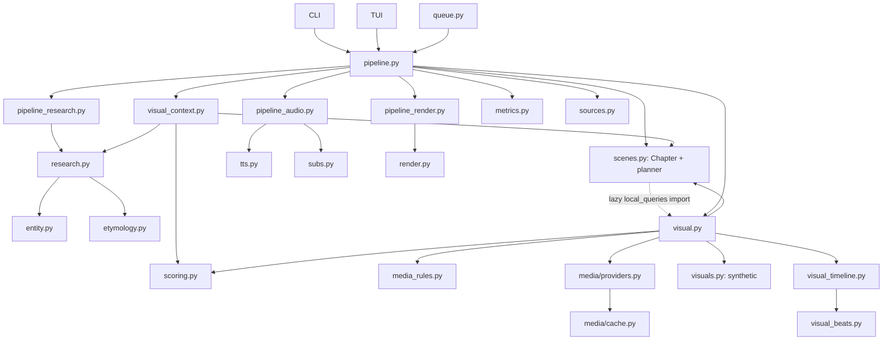

# Auditoria da arquitetura real do Curio e plano de migração

Data: 2026-10-04  
Base examinada: commit `7d0c148` e checkout limpo.  
Escopo: todos os módulos Python de `src/curio`, CLI/TUI, configuração, estágios, adapters, providers, caches, métricas, formatos de projeto, suíte de testes, README, `VIDEO.MD`, `REGRAS.md`, relatório/análises recentes. A leitura estrutural foi feita por inventário AST/imports/chamadas; módulos e caminhos de maior risco foram lidos diretamente, especialmente `pipeline.py`, `scenes.py`, `visual.py`, `visual_context.py`, `scoring.py`, providers/cache, áudio, timeline, render, configuração e persistência.

## Conclusão

A separação física feita nos commits anteriores é útil e deve ser preservada. O problema restante é o contrato: os módulos continuam trocando objetos mutáveis e dicionários incompletos, e etapas posteriores tentam completar ou deduzir decisões anteriores. O pipeline executa como uma sequência real, mas o seu “estado de cena” não é fechado depois do planejamento.

O principal contrato de cena é `Chapter` (`stages/scenes.py`). Ele mistura narração, identidade, intenção, representações, queries, contexto do vídeo, rejeições e tempo de render. Depois de `build_chapters`, `pipeline.py` chama uma série de mutadores (`attach_video_context`, `anchor_local_topic`, `fill_missing_context`, enriquecimento etimológico), grava novamente `chapters.json` e infere se o resultado é local pela origem/string `local fallback`. A mídia então interpreta `Chapter` outra vez: gera queries, decide provider order, seleciona estratégia, aplica regras semânticas, baixa, escolhe fallback, resolve reuso e entrega dicionários. `scoring.py` também interpreta campos da cena e usa texto de origem para escolher evidência. Essa distribuição de decisão explica por que uma correção local tende a exigir patches nos vizinhos.

Não há uma especificação arquitetural existente. `VIDEO.MD` define a identidade editorial do produto, não interfaces de software. README descreve parcialmente as capacidades desejadas; código e artefatos persistidos são a evidência operacional.

## A. Fluxo realmente executado

```text
CLI / TUI / queue
  → CurioConfig + run_pipeline
  → RunLog / paths / RunMetrics / SourceRegistry
  → research_stage: target entity → web/specialized sources → ResearchResult → prompt pack
  → script: provided | script cache | LLM chain | genre template
  → grounding checks against research sources
  → scene count from genre/duration/script
  → scene cache | scene LLM JSON | deterministic sentence grouping
  → narration repair / count repair / Chapter construction
  → post-plan context mutation: attach topic → anchor local → language aliases → etymology
  → manual media | media.json cache | visual.fetch_media_multi
  → per scene: waterfall queries → provider requests → normalized assets
      → hard technical/rights gate → semantic score → shortlist → downloads
      → synthetic visual → cross-scene reuse if eligible → reuse annotations
  → SourceRegistry media and credits
  → AI: TTS/cache → timing alignment/fallback → subtitles
    Human: estimated timeline → visual timeline → silent render + teleprompter
  → visual timeline for multi-image mode / timeline artifact
  → audio selection/signature → cached or rebuilt render segments → final MP4
  → metadata.json + sources reports + contact sheet + metrics JSON
```

| Etapa | Entrada → saída atual | Dono atual e quem reescreve/depois usa | Side effects, cache, falhas e testes existentes |
|---|---|---|---|
| Entrada/config | CLI/TUI args + TOML/env → `CurioConfig` | `config.py`; CLI aplica overrides; TUI também altera config. `queue.py` clona via `__dict__` e aplica overrides dinamicamente. | Paths/env; defaults/clamps/coerções. `test_*config*`, CLI/TUI tests. |
| Research/entity | ideia + gênero → `ResearchResult`, `TargetEntity`, fontes, queries, fatos/etimologia | `research.py` coordena consulta e relevância; `entity.py` resolve alvo e identidade; `pipeline_research.py` registra/persiste e retorna `ResearchStageResult` com cópias dos campos do `result`. | Wikipedia/DDG e fontes especializadas via HTTP; cache de etimologia é persistente. Pesquisa pode aceitar grounding fraco (`allow_weak=True`). `test_research*`, entity, etymology, grounding. |
| Script/title | pesquisa/entidade, gênero e ideia ou texto do usuário → `script.txt`, `title.txt` | `script.py` decide LLM/template/fallback. `pipeline.py` lê/grava caches e executa higienização retroativa de marcadores. `research.verify_grounding` valida depois, sem editar o roteiro. | LLM chain/retries; cache por projeto/arquivo, sem assinatura semântica independente. Falhas e templates em `test_llm*`, script tests, pipeline integration. |
| Scene planning | script + contagem + gênero/contexto → `Chapter[]` e `scenes_source` | `scenes.py` chama LLM ou divide frases localmente, corrige narração/quantidade e normaliza payload. `pipeline.py` carrega cache e depois altera contexto e intenção. | LLM JSON; cache `chapters.json`. Falha do planner cai local, mas o consumidor muda de comportamento conforme `scenes_source`/prefixo. `test_visual_model`, `test_pipeline_integration`, LLM fallback/timeout. |
| Visual context | chapters + ideia + entidade/fonte → mesmos `Chapter[]` mutados | `visual_context.py` anexa tópico, aliases, queries, lugares e tipo; usa `scoring` para identidade e chama `_get_json` privado da pesquisa para Wikipedia langlinks; `etymology.py` também injeta dados nas cenas. | Requisição de idioma depois do planner; escrita repetida em chapters JSON e invalidação por `force_after_script`. `test_visual_context`, entity, scene tests. |
| Visual planning/search/acquisition | `Chapter[]`, providers/config → `list[dict]` de cenas/seleções | `visual.py` contém geração de queries, prioridade, concorrência/timeout, cache de busca em memória, dedupe, filtros, scoring, shortlist, downloads, síntese, uso/reuso, timeline e SFX/inserções. `scenes`, `scoring`, `media_rules`, `visuals` e `visual_timeline` participam da decisão. | Providers HTTP, download HTTP/cache persistente, Pillow/ffprobe, arquivos sintéticos. Há `fetch_media` separado em `pipeline_media.py`, sem chamada de produção encontrada; usa scoring/reuso antigo. `_fetch_media_fallback` também não tem chamador encontrado. Cobertura em `test_media_*`, `test_visual_*`, queries/diversidade. |
| Provider/media cache | query → `MediaAsset[]`; asset → bytes local + sidecar | `media/providers.py` normaliza formatos/rights e API; `media/cache.py` baixa bytes e persiste JSON de provenance. Providers não decidem intenção. | Search cache compartilhado apenas dentro do vídeo; downloads `cache/media/<provider>/<asset_id>`. Retry e URL alternativa. Tests `test_media_providers`, `test_media_museums`, funnel/cache. |
| Candidate/scoring/selection | dict com asset/query + Chapter → score/evidência/rejeição/seleção | `scoring.py` reconstrói intenção/campos de evidência; `visual.py` decide gate, score e winner; `media_rules.py` faz technical/rights/topic hard filters; CLIP opcional continua separado e downstream. | Threshold por env; logs/metrics. `test_visual_topic_anchor`, `test_visual_strategies`, funnel/regressões. |
| Audio/TTS/subtitle | script/chapter + áudio/cache → `AudioStageResult`, words/timing/subtitles | `pipeline_audio.py` orquestra TTS, `scenes.apply_timings` muta capítulos, subs constrói SRT/ASS. Humano usa `finalize_project` com Whisper/transcrição e outro caminho de timeline. | Edge TTS/espeak subprocess, Whisper opcional/cache, artefatos locais. Falha de alinhamento vira timeline proporcional. `test_audio_*`, TTS coverage, subtitles, finalize/CLI tests. |
| Visual timeline | Chapter + selected media → beats/backgrounds/inserts/SFX | `visual.py` chama `visual_timeline.build_visual_timeline`; `visual_timeline.py` também escolhe cenas de inserção por releitura lexical de queries/narração; `visual_beats.py` planeja tempos e identidade. | Determinístico por seed, timestamps e config. Persiste `visual_timeline.json` em multi-image. Tests insertions, timeline, visual assets. |
| Render | chapters/media/timeline + config → segmentos MP4/silent/final | `pipeline_render.py` adapta cenas/dados a `render.py`; renderer escolhe movimento, composição e fallback visual se asset ausente. `pipeline.py` decide assinaturas/cache e encadeia FFmpeg. | ffmpeg/ffprobe, segmentos persistidos, cache por conteúdo/path stat/config e assinatura de transição/áudio. Tests render, pipeline integration, verify. |
| Metadata/metrics/review | saída de etapas → `metadata.json`, `media.json`, `sources.json`, métricas, contact sheet | `pipeline.py` monta metadata e chama `RunMetrics`; `metrics.py` agrega e faz backfill; review lê Chapters e mídia para reconstruir apresentação. | JSON persistente; backfill lida com campos ausentes parcialmente. Requests/tokens sem registro ficam nulos em parte dos campos. `test_runlog`, sources, review, metrics. |
| CLI/TUI/queue | usuário/projeto → invocação/edição/retomada | CLI declara subcomandos; TUI é outra interface para mesmos serviços, mais configuração/menu. Queue serializa estado e invoca `run_pipeline`. `swap` altera `media.json`; `rerender` reconstrói sem buscar; `finalize` usa áudio humano. | Projeto é contrato externo entre execuções; lista/status de queue em JSON. Testes CLI, TUI, queue/standby, review/rerender/CLI. |

O layout de saída é o contrato externo de facto para projeto existente: `script/`, `sources/`, `media/`, `audio/`, `subtitles/`, `timeline/`, `render/`, `review/`, `teleprompter/`, `metadata.json`. `Chapter.to_dict/from_dict`, `MediaAsset.to_dict/from_dict`, e dicionários de seleção/timeline formam o schema implícito. O único marcador geral é `pipeline_version="scenes-0.2"`; não há versão/schema por artefato.

### CLI, TUI e modos

- CLI: `generate`, `from-script`, `finalize`, `sources`, `list`, `info`, `review`, `swap`, `rerender`, `verify`, `metrics`, `voices`, `music`, `doctor`, `queue`, `tui`.
- TUI: menus para gerar IA, preparar narração humana/finalizar, roteiro colado, fila, projetos, configuração, diagnóstico/manutenção. Despacha para `run_pipeline`/`run_script_pipeline`/`finalize_project`, mas lê e edita artefatos em comandos de projeto.
- Queue: salva `QueueItem`/status JSON, clona config por atributos, roda cada item no pipeline normal e marca `PAUSED` em `MediaStandby`.
- `swap` usa somente candidatos baixados já persistidos e chama `rerender`; não chama pesquisa/TTS. `rerender` usa `media.json`/chapters e atualiza timeline/MP4. `finalize` transcreve áudio humano, aplica tempos/legendas e renderiza.

## B. Grafo de dependências e acoplamentos



O ciclo `scenes → (lazy) visual.local_queries → scenes validation` é físico/dinâmico. Mais importante, o ciclo conceitual é `scene planner → context mutators → search planner → scorer`: os consumidores inferem e completam a intenção em vez de receber um plano fechado. `visual_context` importa uma função privada de pesquisa; `scoring` é usado por contexto para escolher aliases e por mídia para interpretar cenas/candidatos. `visual.py` chama a timeline e ainda possui funções de timeline/SFX. Isso torna alteração local dependente de detalhes internos de vários módulos.

O pipeline dividido é uma melhora parcial: `pipeline_research`, `pipeline_audio`, `pipeline_media`, `pipeline_render` existem, mas os contratos variam. Research e áudio têm dataclasses de retorno, media retorna tuplas/listas de dicts, render retorna path; o coordenador ainda contém mais de 700 linhas em `_run_pipeline`, mais geração humana e finalize, metadata, cache e side effects.

## C. Fontes de verdade atuais e desejadas

| Conceito | Fontes encontradas / inconsistência | Fonte única desejada |
|---|---|---|
| Tópico | `idea`, `TargetEntity.name`, `video_context.topic`, `global_visual_queries`, `Chapter.subject` | `VideoContext.topic` tipado com provenance; ideia original permanece input editorial, não semântica inferida. |
| Gênero | CLI/TUI → `cfg.genre`, argumento `genre`, `genre_key`, metadata, diretivas passadas estágio a estágio | chave normalizada resolvida uma vez em `GenerationContext`, com `GenreAdapter` imutável. |
| Entidade principal | `ResearchResult.target`, `Chapter.primary_entity`, `subject`, `video_context.primary_entities` | `VideoContext.primary_entity: EntityRef`; cenas referem entidade explicitamente se aplicável. |
| Aliases | target heuristic/LLM, Wikipedia langlink em `visual_context`, `subject_aliases`, aliases contextuais e `textnorm.translate*` | lista de `Alias(value, language, provenance, verified)`; tradução lexical nunca promove identidade. |
| Intent/representations | `visual_intent`, `visual_intent_structured`, entities/context/event/place/period, `representations`, `visual_queries`, `global_visual_queries` | `SemanticScene` decide significado; `VisualPlan` tem representação primária e alternativas tipadas. Query é derivada, não segunda intenção. |
| Query | `local_queries`, `_waterfall_queries`, adapter generic queries, visual_queries, global queries | `SearchPlan` imutável emitido por um SearchPlanner puro que não lê narração. |
| Provider result/asset | `MediaAsset` e suas projeções dict; `MediaSource` no registro; render timeline com campos reduzidos | `Candidate` envolve `MediaAsset` normalizado e conserva query/request/provenance sem cópias editoriais. |
| Identidade de asset | `_selection_asset_key`, `visual_beats.asset_key`, download cache `provider/asset_id`, `_annotate_reuse`; fontes usam URLs | uma função/valor `AssetIdentity`: source ID canônico, hash de bytes após download, fallback escopado provider+id. |
| Uso/reuso/diversidade | `asset_uses`, `reuse_reason`, `reused_from`, `reuse[]`, duas passagens e métricas que recalculam occurrences | ledger por geração + `SelectionDecision`; uso de asset é fato de seleção, métrica só projeta o mesmo fato. |
| Fallback | `visuals.LADDERS`, caso typographic no media engine, diagrama, reuse, `MediaStandby`, render fallback | `FallbackPolicy` central ligada a `VisualPlan`, com nível e motivo explícitos. Render só apresenta decisão final. |
| Duração | config target, Chapter duration estimate/start/end, TTS audio duration, timeline/beat times, metadata duration actual | `Timeline` com unidades explícitas e um dono de timing; scene plan não guarda múltiplos relógios inferidos. |
| Estado execução | RunLog stage string, callbacks progress, queue enum/status, metadata standby/normal, CLI códigos | `RunState`/stage outcome tipados; compatibilidade externa continua traduzida nas bordas. |
| Métricas | `RunMetrics` contadores live, cena_decisions e visual_report, metadata, metrics JSON, backfill | evento/métrica canônica com definição/unidade/fonte; zero somente quando observado; ausência histórica `null`. |
| Cache | pesquisa em memória por execução, download/sidecar, script/chapter/media JSON, TTS por arquivo, etymology JSON, áudio biblioteca, segmentos/MP4 assinados | namespaces explícitos: search response, downloaded bytes, generated artifact, editorial decision. Cache de bytes nunca determina seleção. |
| Config | `CurioConfig` + TOML/env + CLI override + alterações TUI + queue cópia dinâmica | snapshot normalizado imutável por execução; interface constrói configuração, estágios apenas consomem. |

## D. Reparos silenciosos e reconstruções de significado

| Local | Comportamento | Classificação |
|---|---|---|
| `CurioConfig.load` | defaults, parse, normaliza idioma, clampa enums/limites, ignora alguns env inválidos | normalização legítima em config; precisa diferenciar erro de usuário vs valor default nos casos importantes. |
| providers / `MediaAsset.__post_init__` | provider adapta payload, normaliza tags e rights | normalização legítima na borda externa. |
| `Chapter.from_dict`, `_coerce_*` | aceita schema antigo, descarta visual_type/papel/query inválidos, infere tipo ausente de narração | compatibilidade legada necessária; hoje também mascara payload inválido sem resultado uniforme de validação. |
| `scenes.build_chapters` | aceita envelopes variados; completa queries de representations; repara narração via alinhamento aproximado e junta/divide cenas | reparo estrutural potencialmente legítimo se evidência forte, mas responsabilidade do planner/normalizador e resultado da reparação devem ser reportados no contrato. |
| pipeline após scene planner | injeta contexto/aliases/queries, muda tipo e intenção; busca langlinks; enriquece etimologia | responsabilidade no lugar errado; saída não é válida até pós-processamento. Deve virar input explícito do planejamento ou enriquecimento único antes de fechar SemanticScene. |
| caminhos local/cache | pipeline detecta origem pelo `scenes_source`/string `local fallback`; scoring trata as cenas de modo diferente | dívida perigosa: provenance da origem afeta semântica, em vez de mesma estrutura válida. |
| `script` cache | remove marcadores de lista em cache antigo e altera roteiro salvo | compatibilidade de conteúdo, mas mutação silenciosa deve virar migração versionada/reportada. |
| `visual_context.fill_missing_context` | faz request HTTP e fabrica/ancora queries/contexto após planner; usa dicionário lexical apenas em lugar | semântica + rede no enrichment; alto acoplamento e alias sem provenance completa. |
| `scoring.semantic_relevance` | decide que campos representam tópico/cena, cria fallback “contextual representation” pela presença de tokens de medium e detecta caminho local pelo prefixo | avaliação deve consumir VisualPlan; atualmente reconstrói o conteúdo pretendido. |
| `visual._waterfall_queries` | cria aliases/contexto/medium/generic queries conforme representação/genre/local flag | SearchPlanner atual também decide parte do significado e fallback editorial. |
| `visual._search_scene...` | hard gate, score, shortlist, download, síntese e reuse em um fluxo; falhas viram prosseguimento/fallback | fallback legítimo, mas responsabilidade não está em política/decision explícita. |
| pipeline `media.json` reuse | reusa seleção anterior se IDs/caminhos/hard gate passam; invalidation depende de `force_after_script` | cache de decisão editorial acoplado a arquivo/percurso de invalidação; assinatura completa de plano não é fonte do cache. |
| `manual_media_scenes` | associa arquivos em ordem e faz round robin quando há menos imagens; cria decision de formato distinto | fallback legítimo do usuário, mas violação da mesma forma de SelectionDecision; repetição manual é comportamento deliberado que deve marcar origem/reuso. |
| `pipeline_audio` | se word alignment falha, estima tempos proporcionalmente | fallback legítimo, mas chapters são mutados e a fonte/precisão do tempo fica em string paralela. |
| `visuals._role`, render fallback | deriva papel tipográfico ou desenha título genérico se faltam dados | apresentação fallback razoável; downstream deve receber visual final explícito, não reinterpretar semântica. |
| `metrics.backfill_from_metadata` | reconstitui counts e tenta deixar requests/token/downloads `null` | compatibilidade legítima; alguns campos ainda têm valores derivados/defaults e semânticas live/backfill podem divergir. |

## E. Heurísticas e regras concorrentes

| Regra | Implementações/localização | Competição/risco |
|---|---|---|
| Keywords/representações | prompts de cena, `_coerce_visual_terms`, `_coerce_representations`, `local_queries`, `_local_chapters`, textnorm topic phrases, `_waterfall_queries` | contrato aceita várias listas paralelas; planner local e LLM têm fontes de query diferentes. |
| Stopwords/tradução | `textnorm` compartilhado, `research.extract_keywords`, `entity`, `scoring`, `visual.local_queries`, timeline | normalização textual virou input semântico; traduções polissemânticas ainda podem criar pesquisa errada. |
| Tema e alias | TargetEntity, target aliases, `attach_video_context`, `anchor_local_topic`, Wikipedia langlinks, `fill_missing_context`, scoring | alias é dado do pesquisador, mas também consequência de request pós-planner e tradução; evidência não acompanha todos. |
| Gênero | `GenreAdapter`; scripts/scenes/research/visual/typography/audio consumers; `scenes._genre_forbidden`; transições `pipeline_render` por substring | política declarada convive com regras hard-coded nas etapas. Ordem de provider também recebe política na cena. |
| Visual type | prompt; `classify_visual_type`; `Chapter.from_dict`; pipeline contexto; scene type; scoring e `visuals.strategies_for` | mais de um estágio pode redefinir tipo; tipo também escolhe busca e fallback. |
| Providers | ordem global `PROVIDER_PRIORITY`, override histórico em `_provider_priority_order`, genre adapter priority, provider availability | mais de uma lista/ordem; disponibilidade e ordem se misturam com cena/genre dentro do search. |
| Threshold/relevância | `media_rules` hard gate, `scoring.DEFAULT_THRESHOLD`/env, generic score, contextual gates, CLIP opt-in | vários estágios aprovam/elegem; scores lexical/semânticos e pipeline genérico não são uma única avaliação. |
| Dedup/diversidade | `seen_ids`, `_selection_asset_key`, `asset_key`, `asset_uses`, reuse resolution, annotation, metrics hash/occurrences | identidade difere entre search/download/metrics; cópias do mesmo conteúdo podem divergir por URL/id. |
| Fallback/visual local | `visuals.LADDERS`, regras no search para typographic, diagrams.py, `_synth_diagram_for_scene`, reuse contextual, manual standby, render title fallback | diferentes escadas e owners; `visuals` ladder não governa por si só aquisição e pipeline standby. |
| Timeline visual | `visual_beats.plan`, `visual_timeline._topic_terms`/`_topic_score`, scene insertion, render transitions parsing narration | timeline toma pequena decisão de adequação editorial depois que seleção terminou. |

Os adapters editoriais são predominantemente dados congelados/dataclasses (`Pacing`, `ResearchStyle`, `NarrativeStyle`, `VisualStyle`, `GenreAdapter`) e não executam HTTP, LLM ou FFmpeg. Isso é uma boa fronteira a preservar. O vazamento não é que o adapter faça I/O: são consumidores que complementam política do gênero com suas próprias heurísticas.

## F. Módulos grandes e concentração de responsabilidades

| Módulo | Tamanho aproximado | Avaliação |
|---|---:|---|
| `pipeline.py` | 1.571 linhas | Mais do que coordenação: paths/persistence, policy, repair/cache invalidation, source/media bookkeeping, audio/render, human prep/finalize, metadata. `_run_pipeline` tem ~720 linhas; há caminhos AI/human e geração/finalize com montagem de metadata repetida. |
| `stages/visual.py` | 1.706 linhas | Responsabilidades reais distintas: conceito/query planning, provider scheduling/cache, dedupe, technical gate, scoring/shortlist, download, select/diversity/reuse/fallback, synthesis dispatch e visual timeline/SFX. O split deve seguir decisões/outputs, não tamanho. |
| `stages/scenes.py` | 904 linhas | planejamento LLM/local, segmentação, schema coercion, repair, text role/type heuristics e Chapter serialization/validation. Fronteiras produtor/contrato/normalizador sobrepostas. |
| `stages/visuals.py` | 921 linhas | renderer de cards/formas/diagramas e estado para diversidade de visual sintético. `diagram.py` é outro diagram renderer parcial. Duplicação observada, mas unificação depende de política visual; não mover antes do plano. |
| `stages/research.py` | 1.058 linhas | HTTP Wikipedia/DDG, keyword/query planning, ranking/identity acceptance, RAG completion, evidence facts, prompt formatting e grounding verification. Fonte e editorial research misturados. |
| `stages/nvidia.py` | 1.094 linhas | credenciais, provider registry, HTTP/retry/timeout, fallback orchestration, response JSON validation/repair, script helpers. Prompts já estão majoritariamente em `prompts.py`; transporte ainda controla chain. |
| `cli.py` / `tui.py` | 1.055 / 1.307 linhas | CLI mistura parser, workflows e manutenção de projeto; TUI mistura menu, configuração, workflows e manipulação de projetos. Porém, ambas são interfaces externas e usam pipeline partilhado; reorganizar só após contratos core. |
| `metrics.py` | 616 linhas | acumulador concorrente, projeção de relatório, visual timeline statistics e backfill/compatibilidade juntos. Fronteira temporal do dado não tipada. |
| `stages/visual_context.py` | 268 linhas | curto, mas responsabilidade atravessa context planning, identity scoring e I/O de langlinks; tamanho pequeno não significa fronteira simples. |

## Fase 2 — Arquitetura-alvo e contratos

Arquitetura alvo sem pipeline paralelo:

```text
Input + ConfigSnapshot
 → ResearchResult + VideoContext (com proveniência)
 → ScriptArtifact (texto imutável + origem)
 → SemanticScene[] (mesmo contrato para LLM/local/cache)
 → VisualPlan[] (intenção fechada + alternativas/ladder permitidos)
 → SearchPlan[] (queries/contexto/provider policy já decidido)
 → Candidate[] (payload normalizado pelo provider, query/request ligada)
 → Evaluation[] (hard rejects, evidência/scores distintos)
 → SelectionDecision[] (winner/reuse/synthetic/none + reason)
 → Timeline (só tempo/apresentação)
 → RenderArtifact + Metadata/Metrics
```

Contratos propostos, sem criar framework:

- `VideoContext`: tópico canônico, target entity, aliases tipados com origem/idioma/verificação, contexto editorial/pesquisa.
- `SemanticScene`: ID/span de script e narração literal, intent, primary entity/event/place/period, concepts/entities, uncertainty/provenance. Não guarda queries finais nem tempo de render.
- `VisualPlan`: uma intenção que o visual deve comunicar; representação primária e alternativas tipadas; aliases aplicáveis; formas/ladder de fallback permitidas.
- `SearchPlan`: lista ordenada de `SearchQuery` com representação de origem, nível/variante, contexto obrigatório, provider preference e motivos. SearchPlanner não recebe/analisa narração.
- `Candidate`: `MediaAsset` normalizado + query/request/provider provenance. Provider só conhece API e retorna candidatos.
- `Evaluation`: technical/legal pass/reject, topic/scene evidence separada, score explicado, provenance dos campos usados. Não gera queries nem altera cena.
- `SelectionDecision`: winner, ordered candidates/rejections bounded, diversity identity/usage, fallback level e razão explícita; reuse é resultado editorial distinto de fresh acquisition.
- `Timeline`: intervalos e apresentational beats só depois de seleção; renderer nunca escolhe asset nem busca.
- `ExecutionMetrics`: projeções com definições canônicas e provenance live/backfill/unknown; decisão persistida é origem para métricas de seleção.

Os conceitos são dados simples: dataclasses/enum apenas onde validam invariantes concretos. Providers/adapters/cache mantêm fronteiras existentes; não adicionar event bus, DI ou dependências pagas.

### Invariantes a converter em teste

1. SemanticScene preserva o texto/spans do script; nenhuma etapa posterior o reescreve.
2. Planner LLM e planner local produzem o mesmo contrato validado; consumers não consultam `scenes_source` para mudar semântica.
3. Alias usado numa query possui valor, idioma e proveniência; tradução lexical isolada nunca cria entidade.
4. Representação/alternativa deve ser concreta e ligada à cena; palavra isolada não vira query.
5. SearchPlanner recebe plano visual estruturado e emite query completa; não lê narração, contexto bruto ou chama provider.
6. Provider recebe uma query e retorna candidatos normalizados; não decide relevância/diversidade/fallback.
7. Evaluator não cria query, altera cena nem seleciona candidato; todo score/rejeição conserva evidência.
8. Selector considera só avaliação aprovada; identidade do asset é única e reuso não conta como fresh acquisition.
9. Fallback não contorna gates; toda cena entrega selection decision ou motivo verificável para ausência/standby.
10. Cache de busca/bytes/artifact acelera operação, mas não é fonte de preferência editorial; rerender não pesquisa nem sintetiza roteiro/TTS.
11. Timeline e render consomem decision; não inferem significado para escolher mídia.
12. Métrica desconhecida em backfill permanece `null`; fresh/reused/synthetic/selected possuem definições únicas.
13. GenreAdapter segue declarativo; nenhum HTTP/LLM/download/FFmpeg dentro de adapter.

## Fase 3 — Plano de migração incremental

| Fase | Problema e arquivos principais | Contrato/alteração | Comportamento preservado | Testes e critério de conclusão | Risco |
|---|---|---|---|---|---|
| A — modelo semântico | `scenes.py`, `entity.py`, `visual_context.py`, `scene_enrichment.py`, `scene_contract.py`, `pipeline.py`; duplicidade de contexto/scene/representations | **A1–A3 concluídas; A4 pendente:** `VideoContext`, `Alias`, `VisualRepresentation` são tipos runtime; `Chapter` normaliza LLM/local/cache e valida. `scene_enrichment.py` clona planner/cache, centraliza enriquecimento e devolve batch validada com provenance. `SemanticScene` projeta significado sem tempo; aquisição recebe essa projeção e Chapter segue no timeline/render. Falta tornar SemanticScene/planejamento semântico a saída primária de planner/cache e separar spans do script. | `chapters.json` legado, texto literal, CLI/TUI, timing atual | Unit contract sem tempo, planner/cache boundary e old JSON load; integração comprova `fetch_media_multi` recebe `SemanticScene`. | Alto: ampla superfície de Chapter e arquivos existentes. Migração dual read, single write versionado, plano de remoção. |
| B — VisualPlan | `visual_context.py`, `scenes.py`, `scene_local_planning.py`, `editorial.py`, `visuals.py`, `scoring.py`, `visual_timeline.py` | **B1–B4 concluídas:** `VisualPlan` é narration-free, consome `SemanticScene`, não gera queries nem infere flags da narração. `scene_local_planning.py` materializa representações determinísticas. `planning_mode` explícito substitui sentinelas `local fallback`; loader interpreta a sentinela apenas para dados antigos. Enrichment, planejamento de busca e scoring consomem proveniência explícita. Scoring não tokeniza narração; timeline ordena inserções usando apenas queries/representações aprovadas. Falta persistir VisualPlan/SearchPlan como artefatos canônicos e unificar políticas/ganchos restantes de gênero/synthetic. | ganchos de gênero e synthetic visuals atuais | regressões provam ausência de contaminação de gênero, provenance explícita, scoring sem plano semântico e timeline independente da narração. | Compatibilidade com capítulos antigos e heurísticas lexicais existentes. |
| C — SearchPlan | `visual.py`, `textnorm.py`, prompts/regressões | **C1 concluída:** geração determinística vive em `search_planning.py`, consome somente `VisualPlan` e emite `SearchPlan` tipado; cada `SearchQuery` liga texto a representação, kind, alias/proveniência, variante, nível e classe genérica. Aquisição/auditoria consomem esse plano; o helper `_waterfall_queries` e seus mocks internos foram removidos. | providers/config, gates e orçamento; ordenação e conteúdo atuais preservados nos replays cobertos | unit/replay: queries auditáveis; regressões `formavam/gold/laboratory/microscope`, fallback local, pessoa e evento; consulta/provider registrada na decisão. | Cobertura/custo dos providers e qualidade universal das entidades upstream. |
| D — Candidate, evaluation, selection | `visual.py`, `scoring.py`, `media_rules.py`, `providers.py`, `visual_beats.py`, `media_selection.py` | **D1–D3 concluídas:** provider produz `Candidate` ligado ao `SearchQuery` e identidade antes de dedupe/hard gate; `CandidateRejection` registra estágio e origem. `candidate_evaluation.py` coordena score específico/genérico e threshold em `CandidateEvaluation`/`EvaluationBatch`. `media_selection.py` separa fresh/reuse sem alterar scores e cria `SelectionDecision` tipada para real/reused/synthetic/none, com motivo e fallback level. Caminhos alternativos e política de fallback ainda precisam convergir na fase G. | gates, score threshold, CLIP opcional, diversidade sem repetição, direitos | regressões de homônimos, 2-asset/9-reuse, query duplicate/fail; contratos de pool e decisões. | Mudança de ranking e compatibilidade swap/review. |
| E — cache/artifact lifecycle | `pipeline.py`, `media/cache.py`, paths/output, `cli.py`, `sources.py` | **E1 + E2 concluídas parcialmente:** bytes continuam globais por provider/asset; seleção por projeto tem manifesto com assinatura de dados semânticos, provenance `planning_mode`, gênero, `max_images`, providers e threshold. E2 incrementa policy version e invalida seleções adquiridas sob política anterior; escolhas manuais explícitas continuam válidas. `rerender` lê seleção e não adquire. Falta alinhar outros artefatos e lifecycle de source/TTS/subtitle/render. | projetos existentes, cache de download, rerender sem research | unit: assinatura não varia com timing e varia com semântica/proveniência/policy; adquiridos sem manifesto inválidos; manual compatível; integração stale media; rerender sem busca. | Busca adicional ao migrar media.json antigo; mudanças editoriais futuras devem incrementar policy version. |
| F — metrics/state | `metrics.py`, `runlog.py`, pipeline stage result types, backfill | **F1–F3 parciais:** `MediaSelectionStats` é a projeção canônica de cena/status/identidade; `media_visual_report` consome-a, enquanto `visual_plan` cuida de beat/duração/render. Backfill sem seleção usa null e compatibilidade antiga infere por asset. Requests HTTP, invocações adapter e retries têm contadores distintos; duração mede uma chamada adapter com retries/backoff e a duração HTTP por tentativa segue indisponível/null. Planejamento, dedupe e score/evaluation acumulam tempo. Geração humana e assistida agora usam o mesmo relatório de seleção e persistem downloads/proveniência semântica; ainda faltam lifecycle timers completos e reconcile do relatório/render com output. | known/unknown/backfill; 2 cenas/mesmo asset; synthetic/reuse; logical query versus requests; retry; adapter timing; cache hit/download. | Formatos históricos usados por CLI/report consumers. |
| G — coordinator simplification | `pipeline.py`, `pipeline_*`, CLI/TUI/queue | **G1 concluída; G2 pendente:** `pipeline_media.py` não faz aquisição; o segundo caminho sem consumidores foi removido e as funções de mídia manual consomem `SemanticScene`. Próximo: extrair resultados de etapa/estado do pipeline e retirar branches semânticos remanescentes. | comandos, modos AI/human/from-script/finalize/queue e layout de projeto | rg sem callers de aquisição legada; integração cobre manual, cache, standby e fetch; coordenador gradualmente sem mutações semânticas. | comportamento legacy e human workflow. |
| H — profile then optimize | provider/search, pipeline metrics | Primeiro instrumentar tempos de planejamento, queue/provider, retries, downloads, dedupe, scoring/fallback; otimizar gargalo medido. | bounded parallelism/timeouts/courtesy limits | benchmark serial/fake latency e um replay live comparável; sem esconder busca ruim via paralelismo. | rate limit e carga externa. |
| I — validation and cleanup | todos os contratos; docs; `README.md`, `VIDEO.MD` (só se regra de produto) | remover adaptadores internos temporários/código morto, atualizar arquitetura e plan removal. | CLI/TUI e formatos necessários | full suite + compile + history/science/etymology/person runs + rerender + no-LLM/provider fail/cache + visual review. | amplitude de regressões end-to-end. |

Cada fase recebe um commit estrutural próprio, testes relevantes e relatório de fechamento. A/A+B não devem alterar ranking/threshold deliberadamente; D pode revelar mudança comportamental e precisa comparar replay baseline. Não há refatoração big-bang. Não use performance como justificativa até H.

## Baseline verificável

- Última suíte completa na base deste audit: `789 passed` (antes de alterações desta tarefa).
- Arquitetura anterior documentada em `docs/analises/20261002-184536_analise-direcao-visual.md` e relatório de implementação `docs/relatorios/20261002-150849_relatorio_refatoracao-etapas-1-2.md`; esses documentos registram divergências históricas (ex.: módulos menores do que então, contrato posterior ainda mutado).
- Dez relatórios recentes mostram cadeia de patches de cenas fallback, diretor visual, diversidade e queries; o relatório do dia 4 já registrou 9/11 assets únicos após formação de queries. A cadeia confirma o sintoma do usuário e, sobretudo, as múltiplas owners apontadas no código.
- A execução histórica recente levou aproximadamente 271,6 s no estágio de mídia com retries HTTP; isso não separa query planning/request/retry/download/scoring. Profile fica para fase H.
- Testes cobrem providers, fallback LLM, timeouts, semântica visual, cache/reuso, geração de pipeline, TTS/subtitles, render, CLI/TUI, queue e sources. Predomina teste unitário/mocked; ainda não existe gate end-to-end automatizado que valide pixels/qualidade editorial em mais de um domínio. Geração real e visual review são necessárias na fase I.

## Estado da migração (2026-10-04)

Fase 0 de auditoria concluída e commitada (`f43dd67`). A Fase A está em andamento: `src/curio/stages/scene_contract.py` define `VideoContext`, `Alias` e `VisualRepresentation`; `Chapter` normaliza os campos no construtor, valida a estrutura no limite dos planners LLM/local e serializa para `chapters.json` preservando o shape anterior, com proveniência de alias aditiva. Os consumidores que dependem de representações estruturadas aceitam o protocolo `Mapping`, e a API antiga de dict segue durante a migração.

`478be96` estabeleceu os tipos e a serialização. `1d59067` fecha limites de produção e leitura: fallback local valida cada cena e o loader de `chapters.json` converte projetos existentes para o contrato e falha claramente para narração inválida. Testes focados passaram (57), `compileall` passou e a suíte completa passou com **793 testes** (baseline: 789).

Fase B1 materializa o `VisualPlan` antes da aquisição e inclui o contrato na auditoria da decisão. Fase C1 extrai `search_planning.py`: `SearchPlanner` consome só `VisualPlan`, não lê narração, e registra por query origem, representação, alias, variação, nível e fallback genérico. `_waterfall_queries` foi removido; testes antigos agora validam `SearchPlan` ou injetam plano tipado nos testes de aquisição. A primeira suíte completa encontrou um fallback de strip diagram excessivamente amplo; a distinção entre mecanismo visual e contexto científico foi corrigida. Testes focados passaram (130), `compileall` e `diff --check` passaram, e a suíte completa final passou com **796 testes**.

Fase D1 (`8628096`) acrescenta `Candidate` e `CandidateRejection` no limite provider→gate; ambos preservam query/representation provenance, e o reject identifica o hard-gate. A suíte completa passou com **798 testes**. D2 (`0f33382`) introduz `CandidateEvaluation`/`EvaluationBatch` e move a partição score/threshold de resultados específicos e genéricos para `candidate_evaluation.py`; a auditoria consome os resultados avaliados, preservando evidências mesmo quando houve mutação pós-download. A suíte completa passou com **799 testes**. D3 separa a ordenação fresh/reuse em `media_selection.py` e representa o resultado por `SelectionDecision` com identidade, provider/query, score, fallback e motivo. Testes focados validam fresh de score inferior, reuse adiado e os quatro estados; `compileall` e `diff --check` passaram, e a suíte completa passou com **805 testes**.

Ainda restam mutações semânticas pós-planner em `pipeline.py` (`attach_video_context`, `anchor_local_topic`, `fill_missing_context`, enriquecimento etimológico), o uso de `Chapter` em scoring/selection e a separação entre semantic scene e spans temporais. Fase A/B não estão completas, e não se declara contrato arquitetural concluído antes dessas fronteiras serem migradas.

Fase E1 iniciou pela seleção de mídia: `media/artifacts.py` assina somente dados que afetam aquisição/seleção (e exclui `start/end`), com schema e versão editorial explícitos; `VideoPaths` expõe o manifesto adjacente. O pipeline só reutiliza aquisição persistida quando manifesto, assinatura e cenas correspondem; cache adquirido anterior sem manifesto volta à busca. Seleção manual legada é identificada pela proveniência `manual` e preservada. Busca vazia não ganha manifesto, evitando cachear falhas transitórias. Testes focados de cache/pipeline passaram (23 na integração inicial e 16 após extrair o predicado); `compileall` e `diff --check` passaram, e a suíte completa final passou com **809 testes em 153,92 s**. E1 concluiu assinatura da seleção visual; outros artefatos e o lifecycle de source/TTS/subtitle/render permanecem pendentes.

Auditoria de métricas antes de F1: `media_searches` e `requests_per_provider` eram incrementados pelo mesmo evento; `queries_count` contava consultas com provider ativo, não requests; `results_received` não recontava hits do cache compartilhado; download físico excluía hit de bytes cacheados; `visual_scene_count` contava apenas cenas com duração positiva, diferente de capítulos; `visual_assets_unique` mede uso no timeline, enquanto `visual_report.unique_assets` media asset atribuído a cenas; `visual_assets_reused` e `visual_report.reused_assets` também usam unidades diferentes. Backfill já marcava consumo externo ausente como null, mas campos de `visual_report` podiam virar zeros quando `media` sequer existia. F1 extraiu `MediaSelectionStats` com identidade estável por URL/ID, estados de `SelectionDecision` e valores unknown; `visual_plan` permanece dono das medidas de timeline. Contratos de busca, requests, tentativas/retry e timing ainda não foram consolidados. Testes focados passaram (69), `compileall` e `diff --check` passaram, e a suíte completa passou com **811 testes em 155,83 s**.

F2 removeu o segundo acumulador de `media_searches`: o nome persiste como alias da contagem `provider_requests`; `logical_queries` conta textos executados e `provider_search_calls` conta invocações de adapter, uma por provider/query (cache compartilhado não gera chamada). `media_record_retry` registra retry por provider em Wikimedia e download; busca conta duração agregada por chamada de adapter incluindo retry/backoff. `query_generation_time`, `deduplication_time` e `selection_time` agora medem planejamento, identity dedupe e avaliação/ranking respectivamente. O antigo `time_per_request` sempre foi não instrumentado e passa a `null`; novas `provider_search_durations` não fingem ser durações HTTP por tentativa. A primeira rodada full teve cinco falhas por mocks do fetch privado que não aceitaram o novo coletor opcional; atualizar as fixtures resolveu as cinco, sem mudança na semântica de produção. Testes focados passaram (29), `compileall`/`diff --check` passaram e a suíte completa passou com **813 testes em 144,52 s**.

Fase A2 começou retirando as decisões de enriquecimento semântico do coordenador. `scene_enrichment.enrich_scenes` recebe origem e inputs explícitos, clona o resultado do planner/cache, aplica em ordem contexto global, ancoragem local (só quando proveniência local a justifica), identidade verificada e enriquecimento etimológico (só para perfis com Wiktionary), valida o contrato e devolve os campos `source/applied/scene_ids`. `pipeline.py` deixa de chamar quatro mutators e escrever `chapters.json` após cada um; persiste o batch pronto uma vez e grava provenance no metadata. Os mutators internos seguem temporariamente como helpers do componente e para testes de unidade, até consumidores serem migrados. Testes focados de contexto/etimologia passaram (38), `compileall` e `diff --check` passaram, e a suíte completa passou com **815 testes em 145,81 s**.

Fase A3 introduz `SemanticScene` sem campos temporais e `Chapter.semantic_scene(source)` como adaptação por projeto. A aquisição/scoring recebe essa visão em `pipeline.py`; timeline/subtitle/render continuam consumindo Chapter. `VISUAL_TYPES` passa a ter uma única definição no contrato. Regressões confirmam ausência de `duration_estimate/start/end`, isolamento de contexto/provenance e tipo de entrada no limite pipeline→media. Testes focados passaram (59), `compileall`/`diff --check` passaram, e a suíte completa passou com **816 testes em 146,45 s**. Ainda há uma ponte de compatibilidade (planner/cache ainda produzem Chapter); a derivação de fallback local foi migrada para B2.

Fase B2 conclui a separação do planejamento visual local: `local_queries` saiu de `visual.py` para `scene_local_planning.py`; a conversão de Chapter para `SemanticScene` materializa representações locais quando faltam representações/queries e contexto estruturado. `VisualPlanner.build_visual_plan` não aceita callback, não lê narração e deriva flags apenas do contrato semântico. `local_query_seeds` foi removido do contrato e do SearchPlanner. Testes focados passaram (165), compilação e `diff --check` passaram; suíte completa: **817 testes em 145,92 s**. A heurística determinística existente foi realocada, não reescrita; sua simplificação fica para uma fase de qualidade/proveniência própria.

Fase B3 substitui o prefixo textual `local fallback` por `planning_mode` (`llm`, `deterministic`, `unknown`) nos contratos de Chapter/SemanticScene/VisualPlan. Novos producers declaram o modo; somente `Chapter.from_dict` infere-o para arquivos legados. Enrichment, planejamento de busca e scoring consomem proveniência explícita. Scoring não extrai mais núcleo nem âncora da narração; sem plano semântico, não concede nota por coincidência lexical, e regressão prova que representação declarada continua pontuando. Focados: 92 passaram; compileall/diff-check passaram; suíte final: **821 testes em 145,51 s** (um teste legado que exigia tokenização da narração foi migrado para os dois contratos novos).

E2 fecha a invalidação que a provenance nova exige: `planning_mode` passa a fazer parte da assinatura do manifesto e `SELECTION_POLICY_VERSION` sobe para 2, fazendo seleções adquiridas antigas serem buscadas novamente. A regressão compara dois planos com semântica textual idêntica e modos distintos. Testes focados passaram (26), compileall/diff-check passaram.

F3 unifica a projeção de mídia no metadata das gerações humana e assistida: `visual_report` e `provider_downloads` vêm do mesmo `RunMetrics`, e ambas persistem `scene_context_enrichment` quando disponível. Antes, o fluxo humano deixava esses campos ausentes e perdia a proveniência, embora a execução assistida os registrasse. Testes de integração cobrem os dois fluxos; focados passaram (4), compileall e `diff --check` passaram. O restante de F3 — timers completos e reconciliação de output/render — continua aberto.

G1 remove `pipeline_media.fetch_media` e `_resolve_reuse`: `rg` confirmou ausência de consumidores, e esse código reimplementava provider loop, ranking de título e política de reuse em paralelo ao diretor visual ativo. O módulo fica responsável por standby e seleção manual. `manual_media_scenes`, assinatura da seleção em `pipeline.py`, validação de cache semântico e rótulos de fontes recebem `SemanticScene`, não Chapter. Regressões focadas passaram (27), compileall/diff-check passaram; suíte completa: **822 testes em 145,11 s**.

B4 remove a extração de termos da narração em `visual_timeline._topic_terms`, onde `order_for_insertion` podia reinterpretar texto durante o render para decidir qual imagem era mais específica. A ordem complementar agora deriva somente de representações e visual queries materializadas; sem elas, mantém a ordem de aquisição sem inventar prova. Regressão cobre narrações diferentes com o mesmo plano, e uma cena sem plano mas com narração não relacionada não ganha inserção. Focados: 46 passaram; compileall/diff-check passaram; suíte completa: **823 testes em 146,90 s**.

Auditoria das 20 métricas mais recentes excluindo testes: os arquivos `proj-review` que pareciam registros de usuário apontavam para `pytest-of-chocotonilitz/pytest-118`, portanto também são métricas de teste e foram excluídos. Não havia geração de produto entre as 20 mais recentes; as execuções históricas reportadas em `docs/relatorios/20261004_relatorio-formacao-queries-diretor-visual.md` e `docs/relatorios/20261003-154349_auditoria-diretor-visual.md` continuam como evidência de produto anterior, não como validação dos commits desta migração.
